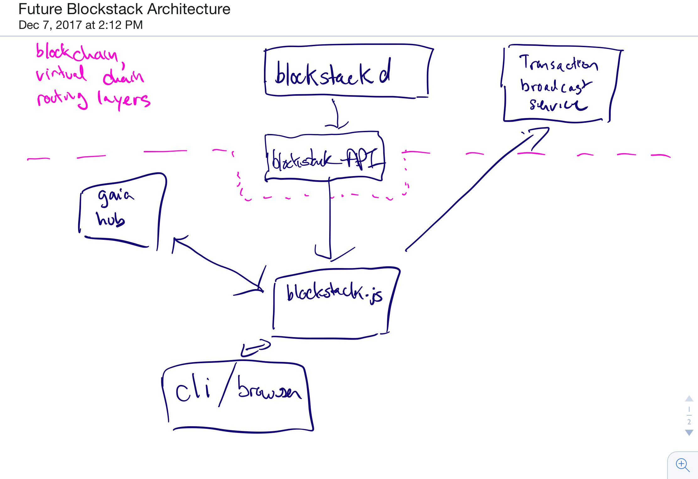

# Components

1. Blockstack Client (Browser or a lightweight CLI)
1. blockstack.js
1. blockstackd (indexer)
1. Blockstack API 
1. Gaia Hub

# Client

* This is blockstack-browser, or a lightweight blockstack-cli
* This client interacts with Blockstack through `blockstack.js`
* It is *very important* that the browser interact with blockstack only using `blockstack.js` -- this is a dog-fooding policy, which will allow for developers to implement deep integration of their applications into blockstack -- they can perform their _own_ on-boarding, etc.
* Profile resolution is performed by clients by default (doing this client-side may have pitfalls, and we should have an option of allowing deployments of micro-services if necessary in the future, but the design does not depend on this)
* Search is *also* an application of Blockstack, which should not be part of the core architecture. We can provide a search service as a demo and prototype, but again, design should not depend on this.

# Indexer (blockstackd)

* This is _only_ the consensus core and atlas network
* This is essentially just the `/blockstack/` directory of `blockstack-core`
* Updates should be expected on the order of months
* Most updates should be expected to be consensus-breaking
* API versioning policy probably requires thought. We don't want to continuously be breaking the API, however, we also don't want to inflate the codebase with API front-end code
* This API should be minimal -- anything that can be implemented by the resolver or the API _should_ be.

# Blockstack API

* This separates a consumer-facing API from the indexer
* Analogous to `insight-api` for `bitcoind`
* This piece may change frequently -- updates on the order of weeks
* Versioned using strict versions where endpoint behavior *never* changes.
* Separated from the indexer because of:
  * Update frequency
  * API support breadth
* Endpoints are things like:
  * Names owned, consensus hash, get zonefile

# Gaia Hub
* Supports:
  * `PUT /:address/:file`
  * `GET /hub_info` -- returns the URL prefix for perfoming fetches, and information on how to generate a a validly signed token for authenticating writes
* Access Control of application storage is performed with a write token, generated by performing a valid signature for the URL address.
  * Writes to `hub/:address/:file` must present a validly signed token with `:address`
    * Use app private keys for per-app stores
    * Use profile signing key for the (root) profile store
  * Note: access control for collections would necessarily be more complex -- but could be controlled via the token file.
* Reads should be performed directly from JS using a normal HTTP client:
  * To get file `foo`, I request `URL_PREFIX + /foo`
* Reads should be protected (for now) by encryption
  * Future designs may be able to use restricted read access
* Reads should not need to be the same domain as writes, but can be
  * This allows future (more sophisticated implementations) to handle things like a Dropbox or GDrive backend (i.e., you would set the `URL_PREFIX` to a service which knows how to translate `/foo` to the Dropbox file)
* The client is not responsible for (or aware of)
  * Replication strategy
  * Access-Control management
* Client _must_ be able to choose which gaia hub to connect to -- and a user owned gaia hub must be able to whitelist allowable addresses.
  * Per-app addresses are a little more complicated -- but whitelisting can still be achieved via the token file. 
* Con of this design: providing local backups for users
  * Local store of app data is useful to developers, and provides more ownership of user data in the case of provisioned gaia hub.
  * There are solutions to this (Jude mentions composable hubs, and replication support) - however, those are lower level design decisions that don't affect the other components.
