# Using the Blockstack Browser

The Blockstack browser gives users the ability to explore and use the
decentralized applications (dapps). The decentralized applications are a new way
to interact with the internet. Dapps give users control of their data. Data
about them personally, name, birthdate, phone number and data about what they do
such as visiting a website or buying an item.

## Understand the Blockstack Browser

Through the Blockstack browser you can create an identity. An identity
represents you as you interact with others through Dapps.  The Blockstack
browser is itself, a smiple Dapp. It allows you to:

* create one or more identities
* send and receive bitcoin
* manage the storage of your profile and application data
* find and launch Dapps

There are two versions of the Blockstack Browser, a web edition and a local
edition. If all you want to do is create, manage, and fund an identity you can
s[imply use the web edition](https://browser.blockstack.org/). If you want to
interact with Dapps built with the Blockstack platform or develop a Dapp
yourself, you need to download and install the browser's local edition.

## Install the local Browser

The Blockstack Browser installer is a _multiple-context_ installer. If you run
it as a user, the installation is avalable only for that user. If you install as
administrator, the installation installs for all users. To find an installer for
your operating system, visit [the Blockstack install
page](https://blockstack.org/install).

## On Mac

Installation requires that you have macOS High Sierra 10.12 or higher. Do the following to install:

1. Download the OSX installer from from <a href="https://blockstack.org/install" target="_blank">the browser installation page</a>.
2. Double-click the downloaded DMG file to launch the installer.

   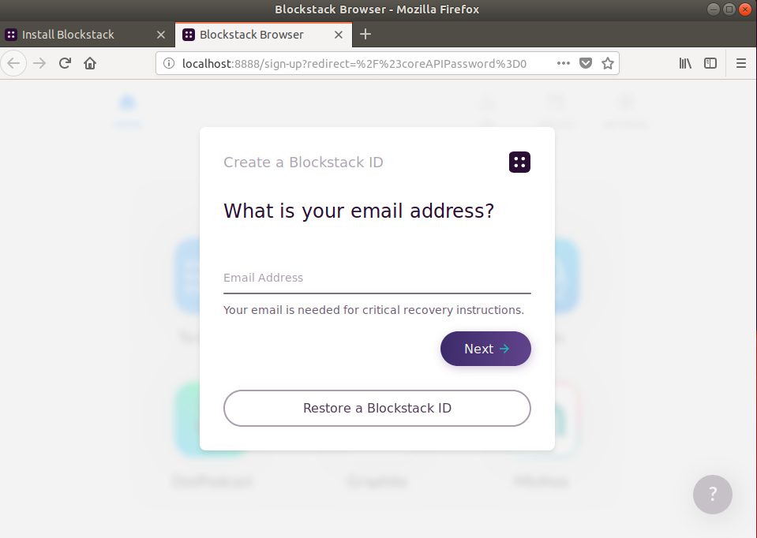

3. Drag the Blockstack.app to the `Applications` folder.
4. Double-click the Blockstack.app to launch it.

   The system displays a notice about opening the file:

   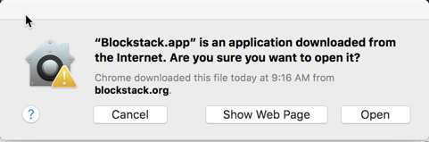

5. Choose **Open**.

   The system opens your default browser with the Blockstack Browser
   application, running from your machine (localhost). You'll also see the
   Blockstack icon in your machine's

   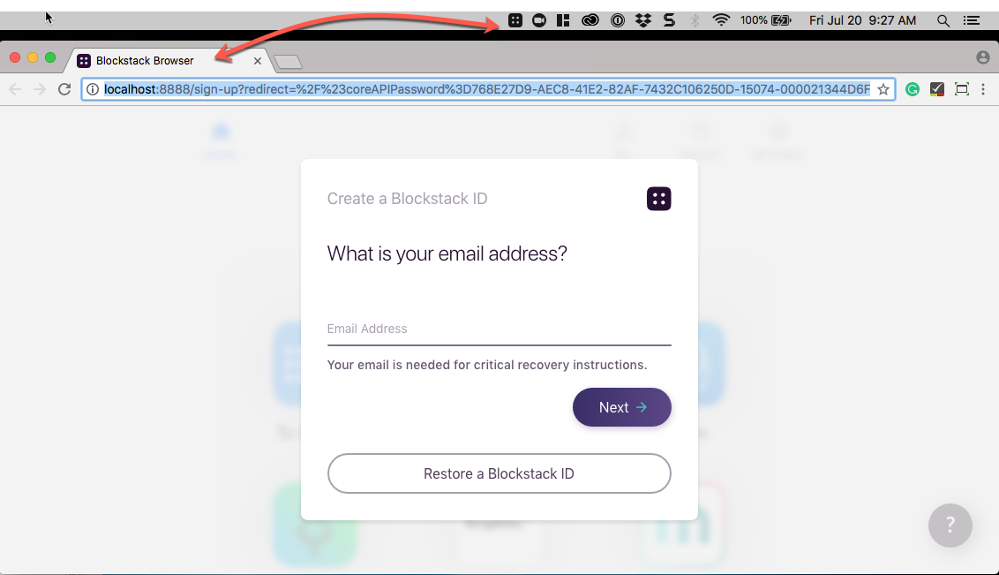

   If you have loaded an identity already via the Blockstack web application,
   you are already logged into the local application:

   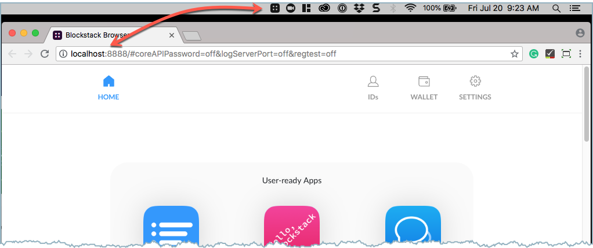


## On Windows

Installation requires that you have Windows 10 or higher. Do the following to
install:

1. Download the Windows installer from from <a href="https://blockstack.org/install" target="_blank">the browser installation page</a>.
2. Double-click the installer package to launch it.

   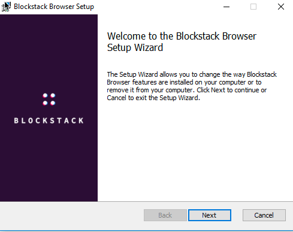

3. Open the Wiindows **Start** menu and click on the recently added **Blockstack Browser**.

   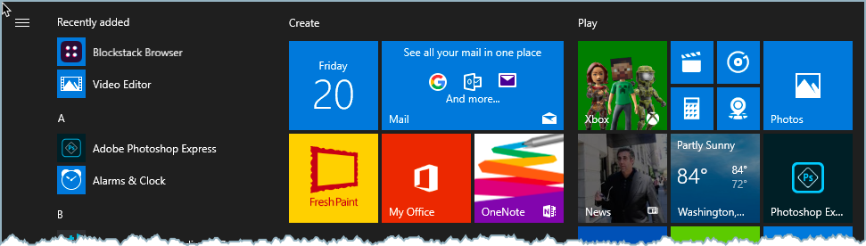

   The system displays a Windows Security Alert.

   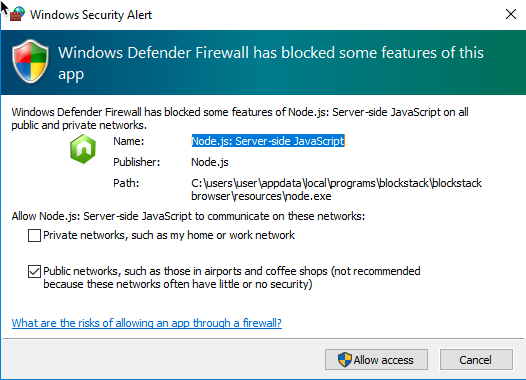

4. Choose to **Allow access**.

   The system opens in the Blockstack Browser application.

    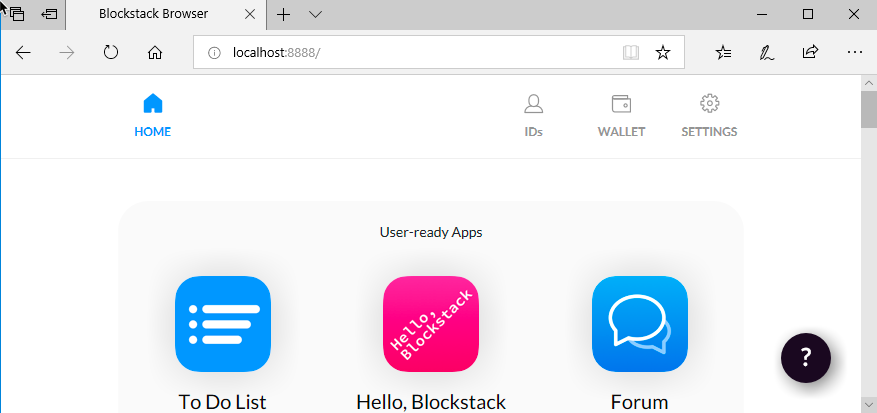


## On Linux

The Blockstack installation on Linux requires Docker. Before installing
Blockstack, <a href=“https://docs.docker.com/install/” target="_blank">install
the version of Docker appropriate for your operating system</a>.

>**Note**: The Blockstack script used in this procedure runs `docker` commands. Depending on how you installed and configure Dockered on your system, it may or may not be necessary to have `root` or `sudo` privileges.  For this reason, the commands below show the use of `sudo` when interacting with the script or the `docker` executable. If your installation allows running Docker with lower privileges, you can omit it.


1. Download the Linux installer from from <a href="https://blockstack.org/install" target="_blank">the browser installation page</a>.

   This downloads a `Blockstack-for-Linux-v0.30.0.sh` script to your local drive.

2. Open a terminal and navigate to the directory containing the downloaded script.

   When the script downloads, it is not executable.

3. Set the executable bit on the file.

    ```bash
    $ chmod u+x Blockstack-for-Linux-v0.309.0.0.sh
    ```

4. Enter the command without any arguments to see the available subcommands.

    ```bash
    $ sudo ./Blockstack-for-Linux-v0.309.0.0.sh
    blockstack docker launcher commands:
    Install-protocol-handler -> install a protocol handler for blockstack:// links

remove-protocol-handler -> uninstall the protocol handler for blockstack:// links

pull -> fetch docker containers from quay
start -> start the blockstack browser server

    stop -> stop the blockstack browser server
    To get started, use
    $	./Blockstack-for-Linux.sh pull
    $	./Blockstack-for-Linux.sh install-protocol-handler
    $	./Blockstack-for-Linux.sh start
    This *requires* Docker to run.
    To remove the protocol handler (the only thing 'installed' when you run this launcher)
$	./Blockstack-for-Linux.sh remove-protocol-handler
    And this will start the environment for running the Blockstack Browser
Note: the Docker containers mount your /home/<user>/.blockstack directory
    ```

5. Use the script to `pull` the Blockstack Docker images you need.


    ```bash
    $ sudo ./Blockstack-for-Linux-v0.309.0.0.sh pull
    ```

    Depending on your network speed, this can take some time.

7. Use the `docker image ls` command to confirm you have the image.

    ```bash
    $ sudo docker image Is
    REPOSITORY	TAG	IMAGE ID	CREATED
    quay.io/blockstack/blockstack-browser	v0.30.0	ad05fd844f59	2 days ago
    ```

8. Install the protocol handler

    ```bash
    $  sudo ./Blockstack-for-Linux-vO.30.0.sh install-protocol-handler

    Registering protocol handler
    ```

9. Start the Blockstack containers.

    ```bash
    $ sudo ./Blockstack-for-Linux-vO.30.0.sh start

    C3092592e59abe3559fdb49d070a7aa5e99165c7d9f2flla20ecaf4e0dfc2f46

    cd92f61ae473d54398da987f5023f5462b29c03f08584ebb3c9fIbb4cd790c69

    Registering protocol handler
    ```

    The system launches the Blockstack Browser application for you.


    


Until you stop the Blockstack containers, the application will continue to run on your system. To display the status of the Blockstack containers, you can use the `docker container ls` command.

```bash
$ sudo docker container ls --format '{{.ID}}\t{{.Image}}\t{{.Status}}\t{{.Ports}}\t{{.Names}}'
```

Use `./Blockstack-for-Linux-vO.30.0.sh stop` to stop the Blockstack browser and its containers.


## Uninstall the browser

If you installed the browser using an installer, follow the instructions for
your operating system.

## On Mac

1. Quit the Blockstack application if it is running.

   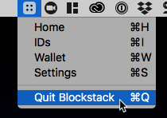

2. Check if you have a Blockstack device and eject it if you do.

   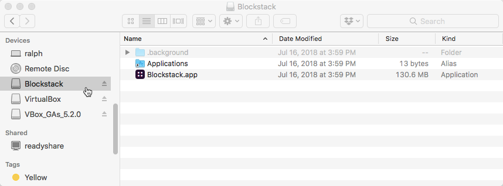

3. Use the Finder to open the **Applications** folder.
4. Locate the Blockstack application.
5. Open your `Applications` folder and locate the **Blockstack.app**.
6. Drag the appliation to the trash.
7. Delete the `/Users/USERNAME/Library/Application Support/Blockstack` folder.

   From the command line:

   ```bash
   $ rm -r /Users/moxiegirl/Library/Application\ Support/Blockstack
   ```

## On Windows

1. Open the **Start** menu.
2. Click **Settings > System**.
3. Open for the **Apps & features** item.

   

4. Locate the **Blockstack Browser** and choose **Uninstall**.

   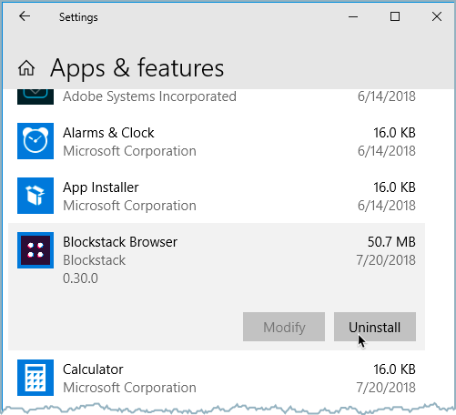


## On Linux

Your Blockstack instalaltion relies on Docker containers and their associated
images.  It also includes a supporting protocol handler you must remove.  If you
installed Docker so that you can run Blockstack, you can uninstall Docker as well,
but that is not explained here.

Do the following to uninstall Blockstack:

1. Stop and remove the Docker containers if they are running.

    ```bash
    $ sudo ./Blockstack-for-Linux-vO.30.0.sh stop
    stopping the running blockstack-browser containers
    69a686799d4f
    56fc6189ff97
    69a686799d4f
    56fc6189ff97
    ```

2. Remove the associated Blockstack images.

    ```bash
    $ sudo docker image ls
    REPOSITORY	                          TAG	    IMAGE ID	    CREATED
    quay.io/blockstack/blockstack-browser	v0.30.0	ad05fd844f59	3 days ago
    $ sudo docker image rm ad05fd844f59

    Untagged : quay.io/blockstack/blockstack- browser :vO.30.0
    Untagged: quay.io/blockstack/blockstack-browser@sha256:b20c9514c56b99398fd4946af39e7537b807e85694943ac3b8807dlb3625833b
    Deleted: Sha256:ad05fd844f5948blee06a0a09228df946478393c0a7588cbc65dlb8817f5b34e
    Deleted: Sha256:7c3d0043f2ba01cf285f3fe09701b086c349b6380c2e42f25b31ac65c6626ec8
    Deleted: sha256:54ea2aa7d7d000e7483f299eeca9e5466fa86231f4cd4cld3c3096d97e61c5df
    Deleted: sha256:38e61054355adefc3c2de031462114a9946cfc0e44444a38a27d0f115aba0da2
    ....
    ```

3. Use the script to remove the protocol handler

    ```bash
    $ sudo ./Blockstack-for-Linux.sh remove-protocol-handler
    ```

4. Delete the script.

    ```bash
    $ rm Blockstack-for-Linux.sh
    ```


## Install a local Blockstack browser

You have Blockstack Browser installed: If you start from ADD USERNAME from IDs window, jump to 6.
1. You do not have the Blockstack Browser installed: go to https://explorer.blockstack.org/ 67
2. Search for your name typing “yourname.id” on the search box. If your .id is “free”, the response will be “Ooops ! The name yourname.id doesn’t exist.” or will show a owner “mnbhbu235j46ijnowejjybjb” with Expires field empty and just NAME_IMPORT, no NAME_REGISTRATION.
3. Install de Blockstack Browser, open an account, write by hand on a piece of paper and make two copies of mnemonic 12 words phrase, DO NOT KEEP IT IN THE COMPUTER, DO NOT UPLOAD IT TO THE CLOUD, DO NOT COPY IT IN THE CLIPBOARD.
4. Go to IDs
5. Click ADD USERNAME. (or MORE and CREATE NEW ID if you want more than one .id’s)
6. Try your selected name (without “.id”)
7. If available, check the price.
(If you want to buy a name with your wallet empty the process is a little more complex because the transfer can take a long time and the process will seems frozen, so I recommend to supply your wallet before, go to step 8)
8. Click WALLET
9. Fund your wallet with the correct amount or more.
10. Wait until you see the bitcoin amount in your wallet. Sometimes bitcoin net can take a minute or one hour (or 5) to perform the transaction depending on the demand of network operations, in the following link you will see approx. the time it will take to complete the transaction based on your fee: https://bitcoinfees.earn.com/ 18
10. Back to ADD USERNAME
11. Write your name and click search.
12. Click BUY
13. The process takes one hour or six blocks, DO NOT TURN OFF the browser or the computer for two hours.
