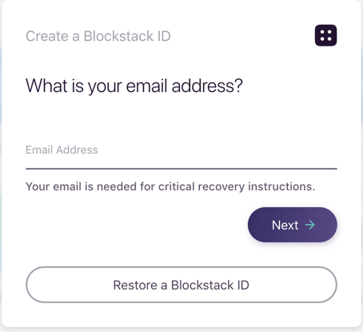
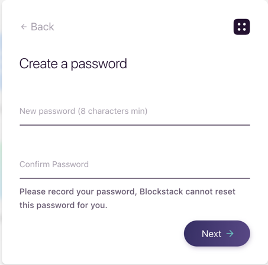
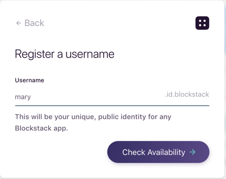
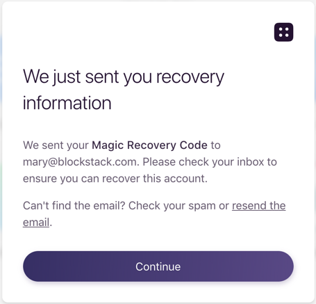

# Work with Blockstack IDs

Interacting within the decentralized internet requires that you have at least
one identity, though you can create several. Your identity is created through a
registrar.  Blockstack maintains a registrar for creating identities that you
can use to interact with distributed applications (DAPPs).

This document explains Blockstack IDs, how to create them, as well as when and
how to restore them.

## Understand Blockstack IDs

To use the Blockstack Browser or to develop a decentralized application you
require a Blockstack ID, for example `moxiegirl.id.blockstack`. A Blockstack ID
is a digital identity that is registered With Blockstack. Your personal data and
storage are built around this ID. Decentralized applications that want to access
your data need your identity and your permission.

When you first sign up through the Blockstack browser, you create an initial
human-readable identity in the `id.blockstack` domain. This initial identity has
the format:

_`USERNAME`_`.id.blockstack`

The _`USERNAME`_ portion must be unique. You enter an email and password to
create the initial identity. Blockstack uses the password to:

 * seed a _recovery code_ an encrypted string, for example `36mWivFdy0YPH2z31EflpQz/Y0UMrOrJ++lH=0EI7c3mop2JuRBm5W1P0BwXxSTazJsUjOAmC55rFUWINqDqGccLio0iwzGclAhaHGZQ5M52`
 * seed a _recovery key_ which is a set of 12 words `applied binge crisp pictorial fiery dancing agreeable frogs light finish ping apple`

The email is provided to allow either Blockstack or a decentralized application
to communicate information to you. In Blockstacks' case, the email is used to
send you reovery information.

While Blockstack registers your human readable ID and the recovery key. _You_ must
record the:

* recovery key
* recovery code (in the order the words apepar)
* initial password

Blockstack does not store them, so it can't give them to you later if they are
lost.

Your initial ID is created in the `id.blockstack` domain. The initial identity
remains primary, and you need this primary ID and its associated information
(recovery code, recovery key, and password) to use the browser again.

Finally, the `id.blockstack` domain is sponsored by the Blockstack registrar and
identities on it are free. Once you are using the Blockstack Browser, you can
create additional identities outside of this domain and controlled by other
registrars. Coin is required to purchase identities on other domains.

## Create an initial Blockstack ID

To create an inititial Blockstack ID, do the following:

1. Open the [Blockstack web applicatin in your browser](https://browser.blockstack.org/sign-up?redirect=%2F).

   The application prompts you for an email address.

   

   You use this email address to recover your identity later. So, if you have
   multiple email addresses, make sure you record which one you used to create you
   ID.

2. Enter an email address and press **Next**.

   The application prompts you to enter a password. Like your email address,
   your password can be used with your recovery code to recover your identity later.
   Make sure you record the password you use.

   **NOTE**:The Blockstack team cannot restore your password for you.

3. Enter a password, confirm it, and press **Next**.

   

   The browser prompts you to register a unique username in the `id.blockstack`
   domain. This is your identity in the decentralized internet. The format of the id
   is:

    _`username`_`.id.blockstack`

    You'll use this initial ID to access the Blockstack Browser.

3.  Enter a unique username and press **Check Availability**.

    

    When you choose an id that is available, the system responds with the following:

    

4.  Press **Continue**.

    The system prompts you to save your **recovery code**. A recovery code is a
    sequence of 12 words.  These words allow you to recover an `id.blockstack`
    that you've created.  You should store the words along with their order, for
    example,  `#1 pink` and so forth.

5. Click **I have written down all the words** when you are done.

   The system places you in the Blockstack browser.  You can begin exploring and
   using dapps.

## Restore a Blockstack ID

When you return to the Blockstack Browser, the browser prompts you to create a
new Blockstack ID or restore an existing Blockstack ID.  If you have a
Blockstack identity, you can open the browser by restoring the identity. To restore an identity, you need one of these sets of information:

* the identity recovery code (`36mWivFdy0YPH2z31E...`) and both the email and password you provided when you created your identity

Or

* recovery key of 12 words (`applied binge ...`) and the email you provided when you created your identity

If you use the second method, the system prompts you for a new password. This password replaces.

recovery key + email + password
recovery code + email and create a new password

## Install a local Blockstack browser

You have Blockstack Browser installed: If you start from ADD USERNAME from IDs window, jump to 6.
1/ You do not have the Blockstack Browser installed: go to https://explorer.blockstack.org/ 67
2/ Search for your name typing “yourname.id” on the search box. If your .id is “free”, the response will be “Ooops ! The name yourname.id doesn’t exist.” or will show a owner “mnbhbu235j46ijnowejjybjb” with Expires field empty and just NAME_IMPORT, no NAME_REGISTRATION.
3/ Install de Blockstack Browser, open an account, write by hand on a piece of paper and make two copies of mnemonic 12 words phrase, DO NOT KEEP IT IN THE COMPUTER, DO NOT UPLOAD IT TO THE CLOUD, DO NOT COPY IT IN THE CLIPBOARD.
4/ Go to IDs
5/ Click ADD USERNAME. (or MORE and CREATE NEW ID if you want more than one .id’s)
6/ Try your selected name (without “.id”)
7/ If available, check the price.
(If you want to buy a name with your wallet empty the process is a little more complex because the transfer can take a long time and the process will seems frozen, so I recommend to supply your wallet before, go to step 8)
8/ Click WALLET
9/ Fund your wallet with the correct amount or more.
10/ Wait until you see the bitcoin amount in your wallet. Sometimes bitcoin net can take a minute or one hour (or 5) to perform the transaction depending on the demand of network operations, in the following link you will see approx. the time it will take to complete the transaction based on your fee: https://bitcoinfees.earn.com/ 18
10/ Back to ADD USERNAME
11/ Write your name and click search.
12/ Click BUY
13/ The process takes one hour or six blocks, DO NOT TURN OFF the browser or the computer for two hours.
