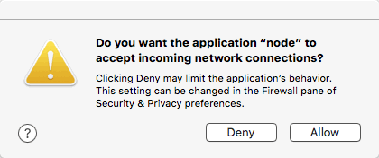
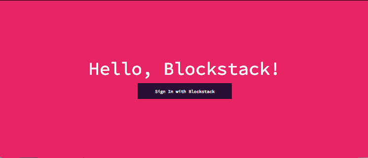
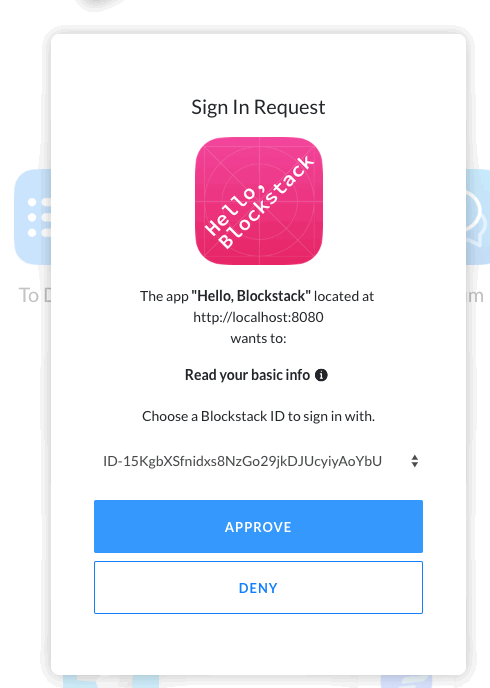
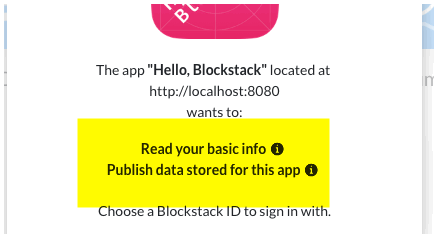
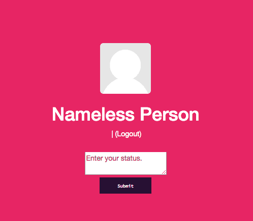
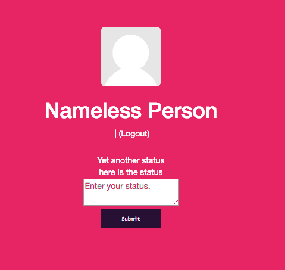

In this tutorial, you build a micro-blogging application using multi-player Gaia
storage. Gaia is Blockstack's [decentralized high-performance storage
system](https://github.com/blockstack/gaia). The tutorial contains the following
topics:

- [About this tutorial and the prerequisites you need](#about-this-tutorial-and-the-prerequisites-you-need)
- [Use npm to install Yeoman and the Blockstack App Generator](#use-npm-to-install-yeoman-and-the-blockstack-app-generator)
- [Generate and launch the public application](#generate-and-launch-the-public-application)
- [Add the `publish_data` scope to sign in requests](#add-the-publishdata-scope-to-sign-in-requests)
- [Allow the user to submit a status](#allow-the-user-to-submit-a-status)
- [Fetch and display statuses](#fetch-and-display-statuses)
- [Lookup user profiles](#lookup-user-profiles)
	- [Add a new route](#add-a-new-route)
	- [Add a rule to process URL paths with . (dot)](#add-a-rule-to-process-url-paths-with-dot)
	- [Put it all together](#put-it-all-together)
- [Wrapping up](#wrapping-up)

This tutorial does not teach you about authentication. That is covered in depth [in another tutorial](#).

<!--TODO: authentication tutorial-->
<!--Strictly speaking not sure it is necessary here to send them out-->

## About this tutorial and the prerequisites you need

At minimum, Blockstack requires macOS High Sierra. This tutorial was written for
a user running macOS High Sierra 10.13.4. The application you build is a
React.js application that is completely decentralized and server-less.  While
not strictly required to follow along, basic familiarity with React.js is
helpful.

When complete, the app is capable of the following:

- authenticating users using Blockstack
- posting new statuses
- displaying statuses in the user profile
- looking up the profiles and statuses of other users

The basic identity and storage services are provided by `blockstack.js`. To test
the application, you need to have already registered a Blockstack ID.

The tutorial relies on the `npm` dependency manager. Before you begin, verify
you have installed `npm` using the `which` command to verify.

```bash
$ which npm
/usr/local/bin/npm
```

If you don't find `npm` in your system, [install
it](https://www.npmjs.com/get-npm). Finally, if you get stuck at any point
while working on the tutorial, the completed [source code is available for
you](https://github.com/larrysalibra/publik) to check your work against.

## Use npm to install Yeoman and the Blockstack App Generator

You use `npm` to install Yeoman. Yeoman is a generic scaffolding system that
helps users rapidly start new projects and streamline the maintenance of
existing projects.


1. Install Yeoman.

    ```bash
    npm install -g yo
    ```
2. Install the Blockstack application generator.

    ```bash
    npm install -g generator-blockstack
    ```

<!-- Need to find out if user is required to have React installed before running Yeoman. Doesn't appear to be the case. -->

## Generate and launch the public application

In this section, you build an initial React.js application called Publik.

1. Create a the `publik` directory.

    ```bash
    mkdir publik
    ```

2. Change into your new directory.

    ```bash
    cd publik
    ```

3. Use Yeoman and the Blockstack application generator to create your initial `publik` application.

    ```bash
    yo blockstack:react
    ```

    You should see several interactive prompts.

    ```bash
    $ yo blockstack:react
    ? ==========================================================================
    We're constantly looking for ways to make yo better!
    May we anonymously report usage statistics to improve the tool over time?
    More info: https://github.com/yeoman/insight & http://yeoman.io
    ========================================================================== No

         _-----_     ╭──────────────────────────╮
        |       |    │      Welcome to the      │
        |--(o)--|    │      Blockstack app      │
       `---------´   │        generator!        │
        ( _´U`_ )    ╰──────────────────────────╯
        /___A___\   /
         |  ~  |     
       __'.___.'__   
     ´   `  |° ´ Y `

    ? Are you ready to build a Blockstack app in React? (Y/n)
    ```

4. Respond to the prompts to populate the initial app.

    After the process completes successfully, you see a prompt similar to the following:

    ```bash
    [fsevents] Success:
    "/Users/theuser/repos/publik/node_modules/fsevents/lib/binding/Release/node-v59-darwin-x64/fse.node"
    is installed via remote npm notice created a lockfile as package-lock.json.
    You should commit this file. added 1060 packages in 26.901s
    ```

5. Run the initial application.

    ```bash
    npm start
    ```

    The system prompts you to accept incoming connections.

    

6. Choose **Allow**.

7. Open your browser to `http://localhost:8080`.

   You should see a simple React app.

   

8. Choose **Sign In with Blockstack**.

    The application tells the user it will **Read your basic info**.

    

Leave your new application running and move onto the next section.

## Add the `publish_data` scope to sign in requests

Every app that uses Gaia storage must add itself to the user's `profile.json`
file. The Blockstack browser does this automatically when the `publish_data`
scope is requested during authentication. For this application, the user files
stored on Gaia are made visible to others via the `apps` property in the user's
`profile.json` file.  

Modify your authentication request to include the `publish_data` scope.

1. Open `src/components/App.jsx` file.

2. Locate the `handleSignIn` handler method.

    ```javascript
    handleSignIn(e) {
      e.preventDefault();
      redirectToSignIn();
    }
    ```

2. Modify the method to this:

    ```javascript
    handleSignIn(e) {
      e.preventDefault();
      const origin = window.location.origin
      redirectToSignIn(origin, origin + '/manifest.json', ['store_write', 'publish_data'])
    }
    ```

    **NOTE**: By default, authentication requests include the `store_write` scope which enables storage.

3. Save your changes.
4. Go back to your app at `http://localhost:8080/`.
5. Log out and sign in again.

    The authentication request now prompts the user for permission to **Publish
    data stored for the app**.

     

## Add support for user status submission and lookup

In this step, you add three `blockstack.js` methods that support posting of "statuses". These are the `putFile()`, `getFile()`, and `lookupProfile()` methods.

1. Open the `src/components/Profile.jsx` file.

2. Expand the `import` statement with`blockstack.js` methods.

    Add `putFile`, `getFile`, and `lookupProfile` after `Person`. When you are
    done, the import statement should look like the following:

    ```javascript
    import {
      isSignInPending,
      loadUserData,
      Person,
      getFile,
      putFile,
      lookupProfile
    } from 'blockstack';
    ```

3. Replace the `constructor()` initial state so that it holds the key properties required by the app.

    Your constructor should look like this:

    ```javascript
    constructor(props) {
      super(props);

      this.state = {
        person: {
          name() {
            return 'Anonymous';
          },
          avatarUrl() {
            return avatarFallbackImage;
          },
        },
        username: "",
        newStatus: "",
        statuses: [],
        statusIndex: 0,
        isLoading: false    
      };
    }
    ```


4. Locate the `render()` method.
5. Modify the `render()` method to add a text input and submit button to the application.

    The following code adds these:

    ```javascript
    render() {
      const { handleSignOut } = this.props;
      const { person } = this.state;
      const { username } = this.state;

      return (
        !isSignInPending() && person ?
        <div className="container">
          <div className="row">
            <div className="col-md-offset-3 col-md-6">
              <div className="col-md-12">
                <div className="avatar-section">
                  
                  <div className="username">
                    <h1>
                      <span id="heading-name">{ person.name() ? person.name()
                        : 'Nameless Person' }</span>
                      </h1>
                    <span>{username}</span>
                    <span>
                      &nbsp;|&nbsp;
                      <a onClick={ handleSignOut.bind(this) }>(Logout)</a>
                    </span>
                  </div>
                </div>
              </div>

              <div className="new-status">
                <div className="col-md-12">
                  <textarea className="input-status"
                    value={this.state.newStatus}
                    onChange={e => this.handleNewStatusChange(e)}
                    placeholder="Enter a status"
                  />
                </div>
                <div className="col-md-12">
                  <button
                    className="btn btn-primary btn-lg"
                    onClick={e => this.handleNewStatusSubmit(e)}
                  >
                    Submit
                  </button>
                </div>
              </div>

            </div>
          </div>
        </div> : null
      );
    }
    ```

   This code allows the application to post statuses. It also displays the
   user's Blockstack ID. To display this, your app must extract the ID from the
   user profile data.

6. Locate the `componentWillMount()` method.
7. Add the `username` property below the `person` property:


    ```javascript
    componentWillMount() {
      this.setState({
        person: new Person(loadUserData().profile),
        username: loadUserData().username
      });
    }
    ```

7. Add two methods to handle the status input events:

    ```javascript
    handleNewStatusChange(event) {
      this.setState({newStatus: event.target.value})
    }

    handleNewStatusSubmit(event) {
      this.saveNewStatus(this.state.newStatus)
      this.setState({
        newStatus: ""
      })
    }
    ```

8. Add a `saveNewStatus` method to save the new statuses.

    ```javascript
    saveNewStatus(statusText) {
      let statuses = this.state.statuses

      let status = {
        id: this.state.statusIndex++,
        text: statusText.trim(),
        created_at: Date.now()
      }

      statuses.unshift(status)
      const options = { encrypt: false }
      putFile('statuses.json', JSON.stringify(statuses), options)
        .then(() => {
          this.setState({
            statuses: statuses
          })
        })
    }
    ```

9. Save the `Profile.jsk` file.

   After the application compiles successfully, your Publik application should appears as follows:

   

10. Enter your status in the text box and press the **Submit** button.

    At this point, nothing is blogged. In the next section you add code to display
    the statuses back to the user as a blog entry.

## Fetch and display statuses

Update `Profile.jsx` again.

1. Go back to the `render()` method.
2. Locate the `<div className="new-status">` containing the text input and **Submit** button.
3. Right after this opening `div` element, add this block.

    ```javascript
    <div className="col-md-12 statuses">
      {this.state.isLoading && <span>Loading...</span>}
      {this.state.statuses.map((status) => (
          <div className="status" key={status.id}>
            {status.text}
          </div>
        )
      )}
    </div>
    ```
   This loads existing state. Your code needs to fetch statuses on page load.

4. Add a new method called `fetchData()`.

    ```javascript

    fetchData() {
      this.setState({ isLoading: true })
      const options = { decrypt: false }
      getFile('statuses.json', options)
        .then((file) => {
          var statuses = JSON.parse(file || '[]')
          this.setState({
            person: new Person(loadUserData().profile),
            username: loadUserData().username,
            statusIndex: statuses.length,
            statuses: statuses,
          })
        })
        .finally(() => {
          this.setState({ isLoading: false })
        })
    }
    ```

5. Call `fetchData()` from the `componentDidMount()` method

    ```javascript

    componentDidMount() {
      this.fetchData()
    }
    ```

6. Save the file.

    After the application compiles successfully, users are able to **Submit**
    multiple statuses and review them in the app.

    


7. Edit the `src/styles/style.css` file.
8. Replace the content with the following:


    ```css
    /* Globals */
    a,a:focus,a:hover{color:#fff;}
    html,body{height:100%;text-align:center;background-color:#191b22;}
    body{color:#fff}
    .hide{display:none;}
    .landing-heading{font-family:'Lato',Sans-Serif;font-weight:400;}

    /* Buttons */
    .btn{font-family:'Lato',Sans-Serif;padding:0.5625rem 2.5rem;font-size:0.8125rem;font-weight:400;line-height:1.75rem;border-radius:0!important;-webkit-transition:all .2s ease-in-out;-moz-transition:all .2s ease-in-out;-ms-transition:all .2s ease-in-out;-o-transition:all .2s ease-in-out;transition:all .2s ease-in-out;-webkit-user-select:none;-moz-user-select:none;-ms-user-select:none;user-select:none;}
    .btn-lg{font-size:1.5rem;padding:0.6875rem 3.4375rem;line-height:2.5rem;}
    .btn:focus,.btn:active:focus,.btn.active:focus{outline:none;}
    .btn-primary{color:#fff;border:1px solid #2C96FF;background-color:#2C96FF;}
    .btn-primary:hover,.btn-primary:focus,.btn-primary:active{color:#fff;border:1px solid #1a6ec0;background-color:#1a6ec0;}

    /* Avatar */
    .avatar{width:100px;height:100px;}
    .avatar-section{margin-bottom:25px;display:flex;text-align:left;}
    .username{margin-left:20px;}

    /* Scaffolding */
    .site-wrapper{display:table;width:100%;height:100vh;min-height:100%;}
    .site-wrapper-inner{display:flex;flex-direction:column;justify-content:center;margin-right:auto;margin-left:auto;width:100%;height:100vh;}
    .panel-authed{padding:0 0 0 0;}

    /* Home button */
    .btn-home-hello{position:absolute;font-family:'Source Code Pro',monospace;font-size:11px;font-weight:400;color:rgba(255,255,255,0.85);top:15px;left:15px;padding:3px 20px;background-color:rgba(255,255,255,0.15);border-radius:6px;-webkit-box-shadow:0px 0px 20px 0px rgba(0,0,0,0.15);-moz-box-shadow:0px 0px 20px 0px rgba(0,0,0,0.15);box-shadow:0px 0px 20px 0px rgba(0,0,0,0.15);}

    /* Input */
    input, textarea{color:#000;padding:10px;}
    .input-status{width:100%;height:70px;border-radius:6px;}
    .new-status{text-align:right;}

    /* Statuses */
    .statuses{padding-top:30px;}
    .status{margin:15px 0px;padding:20px;background-color:#2e2e2e;border-radius:6px}
    ```

9. Save and close the `src/styles/style.css` file.

    After the application compiles, you should see the following:

    


At this point, you have a basic micro-blogging app that users can use to post and
view statuses. However, there's no way to view other users' statuses. You'll add
that in the next section.

## Lookup user profiles

Let's now modify the `Profile.jsx` file to display profiles of other users. You'll
be using the `lookupProfile()` method that you added to the `import` statement
earlier. `lookupProfile()` takes a single parameter that is the Blockstack ID of
the profile and returns a profile object.

### Add a new route

Make some changes to the routing structure of your app so that users can view
other users' profiles by visiting `http://localhost:8080/other_user.id`


1. Make sure you are in the root of your `publik` project.
2. Install `react-router`:

    ```bash
    npm install --save react-router-dom
    ```

3. Edit `src/index.js` file.
4. Add an `import` to the file at the top:

    ```javascript
    import { BrowserRouter } from 'react-router-dom'
    ```

5. Change the `ReactDOM.render()` method in `src/index.js` to:

    ```javascript
    ReactDOM.render((
      <BrowserRouter>
        <App />
      </BrowserRouter>
    ), document.getElementById('root'));

    ```
6. Save and close the `src/index.js` file.
7. Edit the  `src/components/App.jsx` file.
8. Add the new route by importing the `Switch` and `Route` components from `react-router-dom`:

    ```javascript
    import { Switch, Route } from 'react-router-dom'
    ```
9. Locate this line below in the `render()` method:

    ```javascript
    : <Profile handleSignOut={ this.handleSignOut } />
    ```

10. Replace it with the following:

    ```javascript
      :
      <Switch>
        <Route
          path='/:username?'
          render={
            routeProps => <Profile handleSignOut={ this.handleSignOut } {...routeProps} />
          }
        />
      </Switch>
    ```

    This sets up a route and captures the route parameter the app will use as the profile lookup username.

11. Save and close the the `src/components/App.jsx` file.


### Add a rule to process URL paths with . (dot)

You also need to add a rule to your webpack config so that you can properly
process URL paths that contain the `.` (dot) character for example,
`http://localhost:8080/other_user.id`

**NOTE**: In a production app, you must ensure the web server is configured to handle this.


1. Open `webpack.config.js` in the root project directory and locate the following line:

    ```javascript
    historyApiFallback: true,
    ```

2. Replace it with this:

    ```javascript
    historyApiFallback: {
      disableDotRule: true
    },
    ```

    You will need to run `npm start` again for this change to take effect. Don't
    worry, there is a later step for that to remind you.

3. Save and close the `webpack.config.js` file.

4. Edit the `src/components/Profile.jsx` file.
5. Add a single method that determines if the app is viewing the local user's profile or another user's profile.

    ```javascript
    isLocal() {
      return this.props.match.params.username ? false : true
    }
    ```

    You use `isLocal()` to check if the user is viewing the local user profile or another user's profile. If it's the local user profile, the app runs the `getFile()` function you added in an earlier step. Otherwise, the app looks up the profile belonging to the `username` using the `lookupProfile()` method.

6. Modify the `fetchData()` method like so:

    ```javascript
    fetchData() {
      this.setState({ isLoading: true })
      if (this.isLocal()) {
        const options = { decrypt: false }
        getFile('statuses.json', options)
          .then((file) => {
            var statuses = JSON.parse(file || '[]')
            this.setState({
              person: new Person(loadUserData().profile),
              username: loadUserData().username,
              statusIndex: statuses.length,
              statuses: statuses,
            })
          })
          .finally(() => {
            this.setState({ isLoading: false })
          })
      } else {
        const username = this.props.match.params.username

        lookupProfile(username)
          .then((profile) => {
            this.setState({
              person: new Person(profile),
              username: username
            })
          })
          .catch((error) => {
            console.log('could not resolve profile')
          })
      }
    }
    ```

     **NOTE**: For `https` deployments, the default Blockstack Core API endpoint for name
     lookups should be changed to point to a core API served over `https`.
     Otherwise, name lookups fail due to browsers blocking mixed content.
     Refer to the [Blockstack.js
     documentation](http://blockstack.github.io/blockstack.js/#getfile) for
     details.

7. Add the following block to `fetchData()` right after the call to `lookupProfile(username)... catch((error)=>{..}` block:

    ```javascript
    const options = { username: username, decrypt: false }
    getFile('statuses.json', options)
      .then((file) => {
        var statuses = JSON.parse(file || '[]')
        this.setState({
          statusIndex: statuses.length,
          statuses: statuses
        })
      })
      .catch((error) => {
        console.log('could not fetch statuses')
      })
      .finally(() => {
        this.setState({ isLoading: false })
      })
    ```

    This fetches the user statuses.

    Finally, you must conditionally render the logout button, status input textbox, and submit button so they don't show up when viewing another user's profile.

8. Replace the `render()` method with the following:

    ```javascript
    render() {
    const { handleSignOut } = this.props;
    const { person } = this.state;
    const { username } = this.state;

    return (
      !isSignInPending() && person ?
      <div className="container">
        <div className="row">
          <div className="col-md-offset-3 col-md-6">
            <div className="col-md-12">
              <div className="avatar-section">
                
                <div className="username">
                  <h1>
                    <span id="heading-name">{ person.name() ? person.name()
                      : 'Nameless Person' }</span>
                  </h1>
                  <span>{username}</span>
                  {this.isLocal() &&
                    <span>
                      &nbsp;|&nbsp;
                      <a onClick={ handleSignOut.bind(this) }>(Logout)</a>
                    </span>
                  }
                </div>
              </div>
            </div>
            {this.isLocal() &&
              <div className="new-status">
                <div className="col-md-12">
                  <textarea className="input-status"
                    value={this.state.newStatus}
                    onChange={e => this.handleNewStatusChange(e)}
                    placeholder="What's on your mind?"
                  />
                </div>
                <div className="col-md-12 text-right">
                  <button
                    className="btn btn-primary btn-lg"
                    onClick={e => this.handleNewStatusSubmit(e)}
                  >
                    Submit
                  </button>
                </div>
              </div>
            }
            <div className="col-md-12 statuses">
            {this.state.isLoading && <span>Loading...</span>}
            {this.state.statuses.map((status) => (
                <div className="status" key={status.id}>
                  {status.text}
                </div>
                )
            )}
            </div>
          </div>
        </div>
      </div> : null
    );
    }
    ```

    This checks to ensure that users are viewing your own profile, by wrapping the **Logout** button and inputs with the `{isLocal() && ...}` condition.

### Put it all together

1. Stop the running application by sending a CTL-C.
2. Restart the application so that the disabling of the `.` (dot) rule takes effect.

    ```bash
    npm start
    ```

3. Point your browser to `http://localhost:8080/your_blockstack.id` to see the final application.

<!-- TODO: Need another user ID to test with -->


## Wrapping up

Congratulations, you are all done! We hope you've enjoyed learning a bit more
about Blockstack. To use a working version of the app go
[here](http://publik.ykliao.com).
