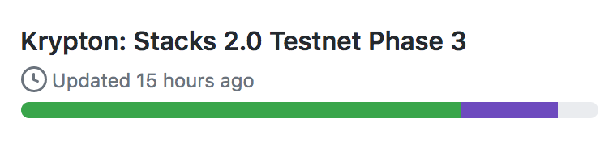
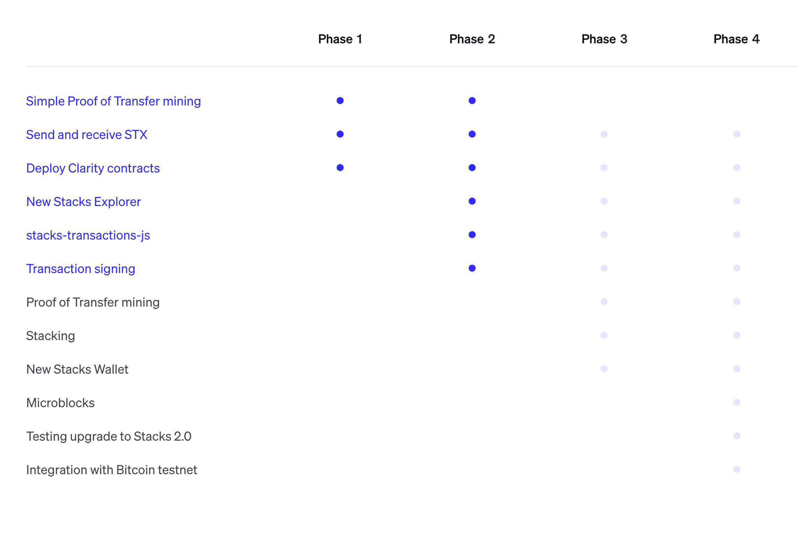

# What is Stacks 2.0?
Stacks 2.0 is a new layer-1 blockchain that uses [Proof-of-Transfer (PoX)](https://blockstack.org/pox.pdf) to connect to Bitcoin. Stacks 2.0 enables secure apps and [predictable smart contracts](https://clarity-lang.org)
in the broader Bitcoin ecosystem. Assets and contracts are secured by Bitcoin, and STX holders can earn BTC by participating in consensus. 

# When is Stacks 2.0 mainnet launching? 

Stacks 2.0 is currently [being implemented](https://github.com/blockstack/stacks-blockchain)
in the Rust language, and the mainnet launch is divided into [five testnet phases](https://www.blockstack.org/testnet).

Stacks 2.0 mainnet is expected to launch in Fall 2020. **There is no exact launch date.** Independent miners will trigger the launch
after the successful completion of all testnet phases. We're currently in the implementation part of Phase 3.

Phase 3 (Krypton) is the most complex phase which implements consensus, mining, and stacking (earning BTC). After Krypton deployment is considered stable, and all issues are resolved, Phase 4 and 5 are mostly about testing.

# OK, so what is the status of Phase 3 (Krypton)?

Phase 3 (Krypton) is currently in the final stages of implementation. Krypton is expected to be deployed in the week of Sep 21, 2020.

You can follow Krypton's progress on [Github here](https://github.com/orgs/blockstack/projects) and on Discord on the [#stacks-core-devs channel](https://discord.gg/XYdRyhf).
Here is a screenshot of Krypton status as of Mon Sep 14th:

# What happens after Krypton?

After Krypton completion, the next two phases (Phase 4 and 5) focus on testing. STX miners and stackers will be able to mine and stack on the testnet at this point. Microblocks is one feature that will be implemented in Phase 4 in addition to testing. Here is a status visual from testnet.blockstack.org (as of Mon Sep 14th):

Blockstack PBC plans to release a new estimate of mainnet launch after Krypton is deployed. Generally, Fall 2020 is the estimated launch.

# Where do I ask questions?

You can join the [Stacks Telegram group](https://t.me/BlockstackChat) to ask any further questions!
