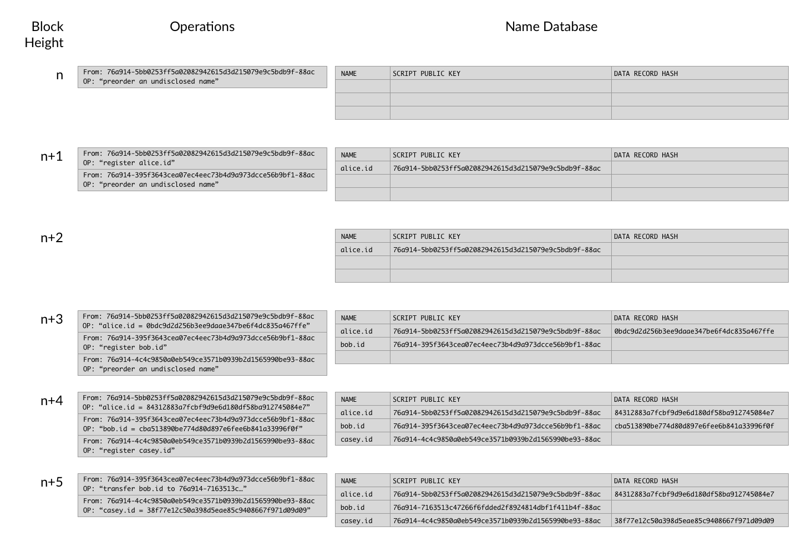

<!--- -->
chapter: Name System
<!--- -->

## Blockstack Name System (BNS)

The Blockstack Name System (BNS) is supported by a network of Blockstack nodes. Each of these nodes maintains a database of domain names, the cryptographic keypairs that own the names, and the data records the names resolve to.

The Blockstack nodes build and continuously update the name database by processing a sequence of name operations, which include name registrations, name transfers, updates of data records associated with names, and more.

Blockstack name operations are embedded in the transactions of an underlying blockchain.  Once incorporated into a block, they are read and processed by all Blockstack nodes, where each node updates its local copy of the name database. Right now, there is only one network of Blockstack nodes, and it sits on top of the Bitcoin blockchain.

### Data Records

Blockstack nodes update their name databases by iterating through each block in the virtual blockchain and processing each of the operations in that block.  All operations are committed at the same time in a given block. Thus, two transfer operations on the same name will not be processed. Time marches forward in a quantized fashion, where every accepted operation is non-conflicting with every other operation in the block.

The first type of operation is a name preorder, where the sender announces that it will register an undisclosed name in the future.  It doesn't want to reveal the name yet, because doing so would allow an eavesdropping attacker to race the sender and steal the name. These operations do not result in any changes to the name database. Instead, they add a record to a pre-order pool.

The second type of operation is a name registration, where the sender announces it is registering a particular name and provides evidence that the name was preordered in a previous transaction.

These two operations together are known as a two-phase cryptographic commitment. In the preorder step, the value that is broadcasted is a hash of the name and the public key that the name should be registered under. Then, in the register step the name and public key are both revealed and the hash in the first step is verified.

The third type of operation is a name transfer, where the sender announces it is transferring ownership of a name it owns to another cryptographic keypair.

The fourth type of operation is a name update, where the sender announces it is replacing the name's associated data record with a new data record. In this operation, only the hash of the data record is provided in the transaction and the data itself is stored elsewhere.

Even though only data record hashes are stored in blockchain transactions, we can use them to verify the authenticity and integrity of the data itself once we get it.  For example, you can host your data in S3, and other peers can verify your data by first obtaining the hash from Blockstack DNS and then checking it against your data's hash.  Because only the name's cryptographic keypair could have feasibly signed the transaction in the blockchain that announced the hash, it is safe to assume that the data is authentic.