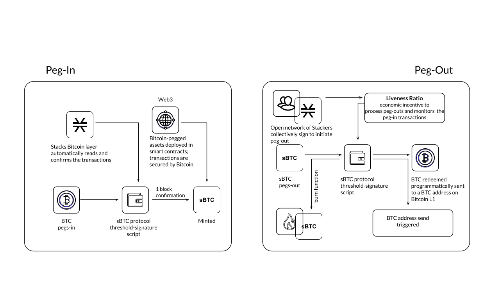

= sBTC: Design of a Trustless Two-way Peg for Bitcoin
:toc:
:sectnums:

[.normal]
Unlocking Bitcoin to be a fully programmable, productive asset would allow
Bitcoin to be the backbone of DeFi and a more secure web3. The ability to move
Bitcoin assets in and out of smart contracts freely and for these contracts to
trustlessly write to the Bitcoin blockchain can unlock hundreds of billions of
dollars of passive BTC for web3. In this paper, we present a novel
decentralized Bitcoin peg mechanism. Using this peg, a BTC-pegged asset can be
issued on Bitcoin layers that is 1:1 pegged to BTC and does not rely on
centralized or pre-determined actors for its functionality. Instead, the peg
mechanism operates in a decentralized manner using an open-membership group of
dynamic actors that are economically incentivized and can start or stop
contributing to the peg functionality.

A decentralized two-way Bitcoin peg has been an unsolved, "holy grail" problem
in the Bitcoin ecosystem, especially as it can enable trustless writes to
Bitcoin. A decentralized peg allows BTC to become a productive asset without
entrusting it to centralized entities and to be deployed in applications like
decentralized BTC-based lending, BTC-backed stablecoins, etc. A wrapped Bitcoin
asset (wBTC) on Ethereum has ranged from $5-$15 billion in usage, even though
it is entrusted to a single custodian and hence antithetical to Bitcoin ethos.
We describe the design of a Bitcoin-pegged asset, called sBTC, that implements
the decentralized peg mechanism using the unique interactions of the Stacks
Bitcoin layer and Bitcoin main chain (L1) to provide high performance and
decentralized security.

Bitcoin is the most decentralized, secure, and durable blockchain. BTC is a unique and valuable asset in the industry, and the Bitcoin blockchain is the best final settlement layer for transactions. Bitcoin optimizes for simplicity and decentralization at the base layer <<bitcoin>>; Bitcoin is, by design, relatively slow and does not natively provide the fully-expressive smart contracts needed to build sophisticated applications. This is unlikely to, and should not, change. Faster and more sophisticated applications must therefore be built outside of the base layer. Bitcoin layers enable this, interacting with the Bitcoin L1 as necessary but providing high performance and advanced functionality outside the base layer. (We use "`Bitcoin layer`" as a broad term meaning a functionality layer outside of L1, our definition of Bitcoin layer includes concepts like L2s, sidechains <<sidechains>>, etc.) Fast payments (Lightning), asset issuance (Liquid), and general smart contracts (Stacks and RSK) are examples of functionality provided by Bitcoin layers.

An ideal Bitcoin layer needs to have three properties:

. Fully-expressive smart contracts with a global ledger so developers can build sophisticated applications in a decentralized way.
. Ability to easily move BTC in and out of the layer in a secure, decentralized manner and programmatically write to Bitcoin.
. High security of transactions backed by 100% of the base layer (Bitcoin) security.

While there has been noticeable progress on Bitcoin layers, the various Bitcoin layers as of 2022 have some limitations: Lightning does not have fully-expressive smart contracts or a global ledger (for immutable records), Liquid and RSK have federated pegs and no Bitcoin settlement, and the initial version of Stacks did not have a decentralized Bitcoin peg. In contrast, recent Ethereum layers have all three properties for ETH and have recently experienced significant growth in users and capital deployed. For Ethereum, the various layers are used primarily for scalability, but for Bitcoin the layers are more important given the limited L1 functionality; Bitcoin layers are required for both scalability and new functionality.

This work on sBTC brings us closer to building ideal Bitcoin layers. Not only can users have access to fully-expressive smart contracts at the Bitcoin layer, but they can easily move BTC in and out of the layer in a decentralized manner. Meanwhile, the layer transactions can be secured by 100% of the Bitcoin L1 security. The decentralized peg mechanism unlocks a new era of Bitcoin applications that can accelerate the growth of the Bitcoin economy.

Our sBTC peg design has the following properties that make it unique:

* *Open and decentralized:* The peg is operated by an open-membership set of dynamically changing signers instead of a predetermined set of federated or centralized parties; the decentralized signers are economically incentivized.
* *Censorship resistant:* The peg operations like signer selection, peg-out requests, etc., happen on the Bitcoin L1 and follow Bitcoin's censorship-resistance, meaning that external actors in the Stacks layer cannot censor these operations.
* *Cheap peg in/out:* The threshold signers are incentivized through BTC rewards from the Stacks layer consensus, giving them strong economic incentives to participate without introducing any additional peg fees.
* *On-chain Bitcoin oracle:* There is no dependency on an external Oracle for peg operations as it uses a unique price oracle implemented on-chain on the Bitcoin L1.
* *Bitcoin security:* The Stacks layer and the peg state automatically forks with Bitcoin L1, automatically settles all transactions on Bitcoin L1 with 100% Bitcoin finality, giving strong security guarantees.
* *Commercially viable:* Real-world participation data suggests that sBTC can reach a circulating supply of hundreds of millions to billions of dollars given recent capital locked in Stacks consensus, making sBTC commercially viable and scalable.

Other than allowing easy movement of BTC in and out of layers, the peg mechanism also allows smart contracts on the layers to write to Bitcoin in a trustless way. This *Bitcoin write functionality* is a major unlock for developers enabling them to build smart contracts that can programmatically send BTC to Bitcoin addresses through the decentralized peg.

== Decentralized Two-way Bitcoin Peg

Smart contracts should not operate at the Bitcoin base layer for security and performance reasons; the base layer should remain simple. We present a decentralized, open-membership Bitcoin peg mechanism using the Stacks Bitcoin layer: BTC can be locked on the Bitcoin L1, and an equal amount of a derived asset, called sBTC, whose value is pegged 1:1 to BTC, is issued on the Stacks layer. Smart contracts can execute using sBTC and, when desired, sBTC can be pegged back out to BTC (i.e., sBTC is destroyed, and an equal amount of BTC is released on the Bitcoin chain automatically). Smart contracts can programmatically send sBTC (peg it out as BTC) to a BTC address, solving the Bitcoin write problem where contracts outside the Bitcoin L1 can trustlessly write to the Bitcoin blockchain.

Readers should see the latest version of https://stx.is/nakamoto[the Stacks paper] <<stacks-nakamoto>> for details on the proposed Nakamoto release and the latest security model of using Bitcoin finality.

The sBTC approach allows smart contracts to use Bitcoin as the monetary asset but with faster and cheaper transactions at the Stacks layer. BTC-derived pegged assets have been implemented earlier, including wBTC on Ethereum, R-BTC on RSK, and L-BTC on Liquid. However, in all those cases, the pegs are managed by and entrusted to either a centralized custodian or a federation of trusted entities. sBTC is a decentralized pegged BTC asset operated by a fully permissionless, decentralized, dynamic set of participants with a clear economic incentive to operate the peg properly.

Such a decentralized Bitcoin peg has been the main roadblock in making BTC a productive asset (to generate profits) by deploying BTC in contracts without entrusting it to centralized entities. This can unlock hundreds of billions of dollars of BTC to be trustlessly deployed in contracts, enabling applications like decentralized BTC lending, BTC-backed stablecoins, etc., with the decentralized security that Bitcoin holders critically desire.

The sBTC peg is enabled by unique characteristics of the Stacks layer and its connection to Bitcoin. In particular:

* The Stacks layer has a unique consensus protocol, Proof of Transfer (PoX), that leverages Bitcoin's Proof of Work (PoW) protocol and naturally supports sBTC. In PoX, Stackers lock up their capital and perform the task of threshold signing for peg-out transactions, and in return, are rewarded in BTC. Stacks miners spend BTC to mine Stacks blocks. It is this BTC that is distributed to Stackers as rewards. This allows *an incentive-compatible economic guarantee for a successful peg*: for Stacks miners, it is always incentive-compatible to mine on the canonical fork, and for Stackers, faithfully maintaining the peg is always their most profitable course of action.
* Stackers are already rewarded by the core consensus protocol. Therefore, *there is no need for users to pay “wrapping fees” when pegging their BTC* in and out during normal operation; the protocol rewards provide the economic incentives. This is a significant advantage, as the wrapping fees in custodial systems become high (as in the case of wBTC).
* There is no fork risk with Stacks. *The Stacks layer automatically “forks with” the Bitcoin L1*, i.e., when Bitcoin L1 forks, the Stacks layer forks accordingly as well. This means that even if Bitcoin forks or reorganizes, the effect on peg operations, peg wallets, and changes to Stacker sets is reflected on the Stacks chain (on the corresponding Stacks forks). These operations materialize on a particular Stacks fork if and only if they are consistent with the sBTC state on that fork. The result is that even though mining and Stacking are both open-membership, a peg is never corrupted due to forks. Stackers, therefore, do not lose money due to forks, and forks do not pose a risk to the safety of users' BTC. This is not the case for pegged BTC assets on chains like Ethereum <<ethereum>> that do not fork with Bitcoin: there, a Bitcoin reorg could make the state of the wrapped BTC inconsistent with the canonical Bitcoin fork, requiring intervention. 
* The set of threshold signers, called *Stackers, are incentivized by BTC rewards from consensus to maintain the liveness of the system* and sign peg-out requests; the BTC rewards are compensation for their work. This compensation in BTC through participation in Stacks consensus is a unique property of the Stacks layer.
* The set of threshold signers is elected through Bitcoin transactions, as contracts on Stacks can read and process Bitcoin transactions. This means that Stacks miners cannot censor the election of Stackers. Similarly, BTC peg-out requests are also broadcasted as Bitcoin transactions, and Stacks miners cannot ignore these requests.
* The system uses the BTC payouts to stackers as a liveness recovery mechanism as well, whereby some BTC payouts are repurposed to fulfill peg-out requests should the Stackers fail to sign peg-out requests in a timely manner.

The sBTC design is commercially viable because it can scale to a sBTC circulating supply of hundreds of millions of dollars worth of BTC today and potentially to tens of billions of dollars worth of sBTC circulating supply in the future. The upper limit on sBTC supply is determined by a configurable parameter called the Liveness Ratio (described below) and is tied to the economic size of STX capital locked. As the economy of Bitcoin applications built through the Stacks layer grows and more BTC is made productive through contracts on the Stacks layer, this sBTC circulating supply limit should increase over time.

The sBTC design does not introduce any custodians or trusted centralized/federated parties in the middle. For billions of dollars worth of BTC to be used in smart contracts through a peg-in system, it's critical that no centralized/federated trust is present in the system. Other existing peg systems for Bitcoin, like Liquid or RSK, rely on trusting a federation where the federation members do not put up any collateral as guarantee for their honest behavior. The sBTC system differs from federated peg systems because it is (a) open membership, anyone can join the system easily and become a signer for peg-out transactions, and (b) the peg-out signers need to lock more collateral than the value of BTC pegged-in providing strong economic incentives for the signers to maintain liveness of the system (their collateral is not released until the signers process all pending peg-out requests).

The only way to mint new sBTC is by depositing equivalent BTC in a script on the Bitcoin main chain. The system always maintains a 1:1 BTC to sBTC ratio and anyone can monitor the open system to verify that the 1:1 ratio is maintained at all times. This is different from custodian approaches, like WBTC, where proof of BTC reserves is less transparent. Further, in sBTC the Bitcoin script/wallet on the Bitcoin main chain is managed by a decentralized and open-membership group of participants vs any single entity or fixed federation. The threshold signers are economically incentivized to maintain the liveness of the peg i.e., to continue signing peg-out transactions.

The sBTC design does not include any peg in/out fees that enables users to peg in and out of the system as frequently as they wish. The users only need to pay the respective Bitcoin L1 transaction fees when using the peg system. In other wrapped Bitcoin designs like wBTC on Ethereum there are typically fees associated with the wrapping/unwrapping function. These fees are necessary for the business viability of the custodian that is performing the wrapping function and maintaining the system. The sBTC design uses BTC rewards from Stacks consensus as incentives for the signers and there is no need for an additional peg fee incentive in the design. The signers are offered incentives at a high rate (recently 7-8% rewards rate based on capital locked <<stacking-stats>>) while the peg in/out functionality remains free to users; they only pay gas fees regardless of the amount of BTC. This topic is further discussed in the “sBTC circulating supply” section.

== Design details of sBTC

The sBTC system is designed to be incentive-compatible with mining on the canonical (i.e., the main and valid) Stacks layer fork, and to ensure that Stackers' most profitable course of action is always to faithfully maintain the peg. sBTC has two modes of operation: the Normal Mode, and the Recovery Mode.  *Normal Mode* is as described earlier: users send BTC sent to a peg wallet/script on the Bitcoin chain that is controlled by a threshold fraction of stackers, measured by the fraction of locked STX they represent. Every time BTC is sent to this wallet (a peg-in operation), an equal number of sBTC are minted to an address of the sender's choosing, maintaining a 1:1 peg.  On a valid peg-out operation, the threshold fraction of Stackers fulfills the peg-out by transferring the desired amount of  BTC from the peg wallet/script to the requested Bitcoin address, through a threshold-signature gated transaction on the Bitcoin main chain. The protocol then destroys the equivalent amount sBTC on the Stacks side.

If the Normal mode encounters a liveness failure for any reason (including loss of BTC), the system transitions to a Recovery Mode until enough stackers come back online to resume signing peg-out requests. In *Recovery mode*, a fraction of the PoX payouts that would have been received by the stackers are redirected to fulfill peg-out requests such that eventually all outstanding peg-out requests will be fulfilled, even if the stackers never come back online. While considerably slower than Normal Mode, the design of Recovery Mode ensures that users' BTC can be redeemed as long as Stacks layer remains alive and PoX mining continues. The Recovery Mode acts as an economic incentive for stackers to fulfill peg-out requests in a timely fashion, otherwise they start losing BTC rewards. Recovering the entire circulating supply of sBTC through Recovery Mode can be a very slow process depending on the circulating supply and the size of BTC rewards through PoX. 

The main safety assumption in the design of sBTC is that the economically rational option for stackers is to always fulfill the peg, given they stand to lose a lot more money than they can make by acting maliciously. A threshold level of signatures at 70% also ensures that a very large set of decentralized participants will need to collude, or get compromised, to attempt an attack on the peg.

The design of both Normal and Recovery modes require careful consideration of the incentives for Stacks miners, stackers, and users. To ensure that operating the peg remains incentive-compatible with mining on the canonical Stacks fork, the Nakamoto release proposal <<stacks-nakamoto>> includes significant updates to the PoX consensus algorithm that went live in 2021 at the launch of the Stacks layer mainnet.

.Peg-in and Peg-out operations in sBTC

In the sBTC design with PoX, *Stackers perform active work to receive PoX rewards and collectively maintain a BTC script/wallet* for the duration of each reward cycle in which their STX are locked. This wallet is used to satisfy peg-out requests. If stackers fail to do so in a timely manner, then their STX tokens remain locked and they do not receive PoX rewards until all peg-out requests are satisfied. Instead, their PoX rewards are redirected to fulfilling peg-out requests.

With the launch of sBTC *all stacking-related transactions and all peg transactions must be broadcast via the Bitcoin chain, as Bitcoin transactions*. The reason for this is that these operations must materialize in all potential Stacks forks. This ensures that Stacks miners cannot censor someone from participating in stacking and being a peg participant. Instead, when a Stacks miner produces a new Stacks block, the peg and stacking operations broadcast at Bitcoin are automatically included in all possible forks. This prevents miners from generating blocks that ignore stacking and sBTC activity, since a block that fails to do this will not be valid in the new consensus rules.

With the sBTC design Stacks is also getting a major security budget upgrade, where forks of arbitrary length are removed and Stacks transactions follow Bitcoin finality after 150 blocks. This means that *all Stacks layer operations that reach Bitcoin finality (typically within 24 hours) can never be forked through the Stacks layer*; the only way to alter these transactions will be to attempt a deep reorg of Bitcoin which is extremely expensive and impractical for depths of 150 or more. Further, Stacks forks of depth 7 require a majority of Stacks mining power plus a majority of stacking signatures, adding to the difficulty of materializing such forks. Finally, because of Bitcoin finality the history of PoX anchor blocks may never fork (required to implement Recovery Mode correctly).

With the launch of sBTC, the set of Stacks miners and the minimum amount of BTC they will commit is known in advance of them mining the next Stacks block. To achieve this, the *Stacks layer requires each miner to additionally commit to the amount of BTC they intend to spend in their next Bitcoin block*.  If their next block-commit does not commit to exactly this amount, then the block-commit is invalid. We call this a block pre-commit. The block pre-commit also unlocks fast blocks (discussed in more detail later), where the set of Stacks miners remains open membership, anyone can join at any time, but the set of miners for a specific upcoming Bitcoin block is known in advance and this set of miners can run a BFT-style quorum signing algorithm to produce fast blocks (every 5 seconds) in between two Bitcoin settlements.

=== Threshold Signature Wallet

A key component of the non-custodial Bitcoin peg design for Stacks is a threshold signatures based wallet/script that is maintained at the Bitcoin main chain. The wallet funds are controlled by a threshold signature mechanism. The potential signatories in a given cycle (typically 2 weeks) are the stackers who have (permissionlessly) locked STX to participate in PoX consensus and receive BTC rewards for performing this peg-out signing work during that cycle. The relative signing power of a signatory on the peg wallet script is determined by their capital locked in PoX. A high threshold level is used for valid signatures: 70% or more signing power is needed for a peg-out transaction to succeed in moving BTC funds from the peg wallet script. This also means that compromising the peg wallet requires 70% of stackers to maliciously collude and be economically irrational, and that as long as at least 30% of stacking power is honest the funds in the peg wallet cannot be compromised. As stacking power and stackers can change every stacking cycle (typically 2 weeks), a unique script/wallet is used per stacking cycle.

When stackers lock their capital, via transactions on Bitcoin, they include a signatory Bitcoin public key in the transactions. These public keys are thereby registered in the PoX contract, so that when the PoX anchor block is mined (at the start of a stacking cycle), the set of all stacker public keys is announced as part of the PoX reward set. These signatory public keys can be combined in a deterministic manner to produce a peg wallet address for the stacking cycle. Signatory public keys must be unique per cycle for each stacker (the signatory keys are different from the BTC reward addresses for the stackers, which can be reused across cycles).

At the end of a stacking cycle, the stackers will learn the next cycle's peg wallet address, and must transfer all remaining BTC from the now-expired peg wallet address to the new peg wallet address, as part of protocol rules, to maintain liveness. The peg wallet uses economic security: stackers typically have a lot more, say 200%, capital locked than the value of BTC in the peg wallet (depending on the configurable liveness ratio), and they stand to forfeit their BTC rewards and their capital will remain locked in consensus unless they continue to maintain peg liveness and follow all peg-out requests and wallet rotation steps.

An important aspect of the peg design is backup mechanisms for what happens if for a given cycle the 70% threshold of signers cannot be met for any reason (e.g., signers are offline for an extended period or refusing to sign transactions). The current proposal is to have explicit backup scripts encoded in the cycle wallet that are automatically activated after a certain number of blocks has passed. One approach is to progressively lower the 70% threshold for recovery to see if threshold can be met at lower levels as a backup. Another proposal is to utilize signatories from previous stacking cycles and allow them to sign peg-outs after a certain time. The details of the backup script formation and selection rules are described in SIP-021 <<sbtc-sip>>.

The detailed protocol specs for sBTC design, peg-in and peg-out operations, interactions with the PoX consensus algorithm, normal and recovery mode, signatory selection and backups etc are available as SIP-021 <<sbtc-sip>>. In this paper, we highlight the most important design elements at a higher level than exact protocol specifications.

=== sBTC Circulating Supply

sBTC is minted by locking BTC in a 1:1 ratio on the Bitcoin mainchain. Theoretically the sBTC circulating supply can be as high as the total number of BTC deposited in the script/wallet. However, to keep the design incentive compatible we have a confirgurable limit on the maximum circulating supply of sBTC: the total circulating supply of sBTC cannot be more than a certain fraction of the value of the STX capital locked in stacking (we use 60% as default). For example, if \$200M worth of STX is locked in Stacking, then the maximum circulating supply of sBTC can be worth \$120M. The sBTC peg value does not depend on STX (the peg value is derived from the BTC locked on the Bitcoin main chain). However, peg liveness and incentive compatibility does depend on the value of the locked STX being high enough relative to the circulating supply of sBTC to ensure the correct incentives.

sBTC offers the following properties:

* An attack will need to compromise more than 70% of the signers to impact the economic safety property. The peg-out transactions require signatures from more than 70% of the participants. Stacks miners can neither cause peg-outs nor can afford to ignore them. The latter is achieved by ensuring that all necessary protocol operations for peg and Stacker set maintenance are broadcast on the Bitcoin chain; these on-Bitcoin Stacks-related operations are processed in the next Stacks block and hence are valid on all subsequent Stacks forks, so Stacks miners cannot ignore these operations. Also, a BTC peg-out happens only as a response to a valid request from an sBTC holder. Finally, peg-out requests materialize when the Stacks transactions that initiate them reach Bitcoin finality, which means that these transactions are secured by 100\% of the Bitcoin hash power and Stacks layer miners cannot reorder or reverse them.
* Peg-outs of arbitrary amounts of BTC are fulfilled within approximately 24 hours, if both stackers and miners operate with a BFT majority. This is the normal functioning of the system, in which, within 150 blocks, peg-outs of any valid amount are automatically fulfilled.
* As long as a BFT majority of miners are honest, the peg system and Stacks chain remain live. If too many stackers don't sign transactions or go offline, the system enters Recovery Mode, in which peg-outs continue to happen, but very slowly. However, theoretically all peg-out requests are eventually fulfilled, even if every stacker is malicious, because stackers do not have a say in block production, and because of the recovery mode mechanism.

=== Decentralized On-chain Bitcoin Oracle

The PoX protocol has the unique property that the BTC/STX price pair information can be obtained directly on-chain on Bitcoin, in a decentralized manner, and there is no external oracle required. This removes a potential attack surface from the design as external oracles are a potential vector for centralization and attacks. The BTC/STX price feed is consumed by Stacks consensus as input to the liveness ratio. A system is only as strong as the weakest point of centralization, so it's safer to avoid any external oracle input in consensus in general. The decentralized, on-Bitcoin oracle feed for the BTC/STX price pair makes it possible to deeply integrate sBTC in the Stacks layer consensus without enabling an external oracle to corrupt the consensus protocol. The use of the on-chain oracle as input for liveness ratio is narrowly scoped. sBTC can only be minted against real Bitcoin locked at Bitcoin L1; the liveness ratio only determines the cap on the possible sBTC supply and takes a moving averages of past 90 days, limiting the impact of any single day price movements on the liveness ratio. Further, user wallets can automcatically check multiple oracles before pegging in sBTC (to independently confirm the on-chain oracle data).

=== Liveness Ratio

The protocol has a configurable limit on circulating supply of sBTC based on the value of circulating sBTC to the value of locked STX ratio, called the liveness ratio. At a liveness ratio of 60%, for every $100M worth of STX locked, the protocol aims to have sBTC supply at or below $60M. If the liveness ratio crosses the configurable limit then peg-ins are temporarily disabled by the protocol until more peg-outs happen and the ratio can go back down (or the ratio limit is increased). The liveness ratio is configurable through on-chain voting. The economic security of the peg is higher at low liveness ratio values and decreases if the liveness ratio increases. One implication of the liveness ratio is that if the value of STX drops against BTC then the circulating supply of sBTC should reduce over time to maintain the liveness ratio. Users can independently monitor the state of the locked capital and peg-out their sBTC as needed. The peg wallet can continue to function even at high liveness ratio, e.g., 90\%, because the stackers/signatories still have more capital locked than they can potentially steal from the peg wallet by colluding with each other.

=== Bootstrapping the Network

The sBTC maximum circulating supply can pose a limitation in the early days of the ecosystem for growth of applications. Some applications like lending pools, Automated Market Makers (AMMs) etc for Bitcoin will require significant Bitcoin liquidity to reach mass adoption. If the sBTC circulating supply is low, say in tens of millions or a few hundred millions of dollars, then that poses a bootstrapping challenge to applications using sBTC. Further, certain applications like lending protocols might require users to deposit additional collateral in response to market movements and users should be able to provide additional collateral in a timely fashion; the potential pausing of peg-ins at high liveness ratio can be a challenge in such scenarios. It's important to note that such bootstrapping challenges will decrease as/if the Stacks network grows in usage and has more capital locked in consensus which then allows a higher circulating supply of sBTC, say in billions or tens of billions of dollars.

We propose to use a high liveness ratio limit in the early days of the network to help the sBTC supply to be as high as possible. Since the liveness ratio is configurable through on-chain voting, we expect the liveness ratio to come down, potentially automatically, as the Stacks network grows in the coming years meaning that over time the economic security of the peg should increase (as the liveness ratio comes down).

Further, custodial or federated Bitcoin assets can also exist on the Stacks layer to supplement sBTC. In fact, xBTC, a custodial Bitcoin asset by Tokensoft and Anchorage already exists on the Stacks layer as of 2022. Custodial assets like xBTC and any federated Bitcoin assets built by application developers can provide additional liquidity and options to users, especially using atomic swaps <<magic-swaps>>, <<defi-swaps>>. The main difference between any federated assets and sBTC is that (a) there is no STX capital locked as a liveness incentive, and (b) the federation members is typically a closed, trusted set and not an open-membership, decentralized set of signatories like sBTC. There is no economic security in federated or custodial assets and economic security is replaced by trust in the federation or custodian.

While federated or custodial assets can provide additional optionality and liquidity to users, they are not critical to our work and we focus on only the decentralized peg. If the sBTC circulating supply is in billions, or tens of billions of dollars or higher then there should be enough liquidity available for mass adoption of Bitcoin apps through sBTC.

=== Security and Risk Assumptions

sBTC is not BTC on Bitcoin L1. sBTC, by defition, is a pegged asset minted against locked BTC in a 1:1 manner on a Bitcoin layer (Stacks). BTC stored on the Bitcoin L1 is the most secure way to store BTC for users in general. Moving BTC to any Bitcoin layer comes with additional complexity and security assumptions; this is true for Lightning, Stacks, RSK, Liquid, and others. Lightning arguably introduces the least additional attack surface and assumptions compared to other Bitcoin layers. For sBTC on the Stacks layer, it's important to understand the security assumptions and potential risks:

* A super majority of Stackers (71%) can steal BTC from the Bitcoin script/wallet on the Bitcoin L1. Stackers will forfeit their STX capital and BTC rewards if they do this, and it might be economically irrational (given they lock more capital than the value of sBTC supply) but it is theoretically possible. The more decentralized the set of Stackers, the harder is this type of attack to pull off; other than economic incentives, it's logistically challenging to convince hundreds or thousands of independent entities and people to coordinate and collude with each other to attempt such an attack.
* Bitcoin L1 miners can censor stacking operations in a long-range 51% attack and attempt to steal the BTC from the Bitcoin script/wallet. This potential attack is economically extremely hard to pull off, given (a) it requires Bitcoin miners to 51% attack the Bitcoin L1 chain for months (potentialy 6+ months) and (b) purchase a large percent of STX liquid supply (at least 14%, worth approx $50M in Dec 2022). The Bitcoin L1 has never been successfully 51% attacked for even days, let alone months, making this attack largely theoretical. Further, every Bitcoin layer assumes that Bitcoin L1 miners will not be able to censor them over a long time period.
* sBTC contract is written in Clarity language and is part of the Stacks consensus. Clarity is a decidable language, meaning that all contract execution paths can be known before executing the contract and rigorous security analysis can be performed. Clarity is, however, more expressive than Bitcoin script and the sBTC contract code is relatively more complex than Bitcoin script contracts typically used with BTC on L1. 

=== Decentralized vs. Federated Bitcoin Derivatives

For Bitcoin peg systems, a decentralized approach like sBTC is not possible without an additional asset like STX that is locked in consensus. sBTC has an open membership set of signatories which is more decentralized and has economic security i.e., the economically rational path for signatories is to always maintain the peg liveness. On the other hand, for federated pegs (like Liquid) users put trust in a federation and these federation members don't have economic risk for misbehaving, they only have reputational risk. We strongly believe that the decentralized sBTC approach is superior.

The comparison between sBTC and federated pegs highlights the need for economic incentives and the STX token. Other than being used as an incentive for securing and maintaining the Stacks layer ledger, the STX asset is critical in enabling the decentralized Bitcoin peg. Without an additional asset like STX, you can only have federated or custodial designs. In the Bitcoin community there is some resistance to new assets other than Bitcoin, which is understandable given the noisy and risky market for non-Bitcoin crypto assets. Our design allows application developers to build and use federated pegs if they wish, but the core consensus protocol focuses only on the decentralized peg. The decentralized peg is possible only because of the separate STX asset. We believe that decentralized and trustless systems are far superior in the long-term over federated designs, especially as the network passes through the initial bootstrapping stage and the sBTC circulating supply can be in billions to tens of billions of dollars providing ample liquidity to users.

== Related Work

Sidechains <<sidechains>> proposed the idea of pegging Bitcoin into a Bitcoin layer. As of 2022, sidechain implementations in the Bitcoin ecosystem, like Liquid or RSK <<RSK>>, don't implement open-membership Bitcoin peg-outs. They rely on a federation of known, trusted entities or centralized custodians to do this. Nomic <<nomic>> has implemented a decentralized Bitcoin bridge/peg in the Cosmos ecosystem which is at an early stage. Projects like tBTC <<tbtc>> and renBTC have implemented decentralized approaches to Bitcoin-pegged assets for Ethereum (recently renBTC is moving to a federated design). tBTC has an open-membership signer set with economic security (similar to sBTC) and most of the differences between sBTC and tBTC stem from the tight integration of the Stacks layer with Bitcoin L1: Stacks has Bitcoin read support (so no need to rely on Bitcoin SPV), Stacks Nakamoto release transactions follow Bitcoin finality, and peg-out requests happen on Bitcoin L1 (vs relying on an external system like Ethereum). tBTC is intended for a different use, where it brings a BTC-pegged asset to the already established application economy of Ethereum. sBTC is intended to grow a Bitcoin application economy as natively around Bitcoin L1 as possible.

Drivechain <<drivechain>> (BIP-300) proposed a two-way Bitcoin peg in 2015. Drivechain, unlike sBTC on Stacks, requires modifications to Bitcoin L1. Further, users can peg-out their assets with a delay of 3 months (vs. 150 blocks or approx a day in sBTC) and there are no coinbase rewards as incentives for miners. Drivechain is still at a proposal stage as a Bitcoin Improvement Proposal (BIP), even after several years. Given the requirement to modify Bitcoin L1, and slow peg-out, the proposal may not be commercially viable. sBTC has stronger economic security than drivechain against potential 51\% attacks from Bitcoin L1 miners, given Bitcoin L1 miners will need to (a) attempt a 51% attack for longer time periods and (b) purchase a large portion of STX liquid supply up front. Spacechains <<spacechains>> is another proposal, at a proof of concept stage, that proposes a one-way peg. Similar to drivechain, it does not require an alternate token but lacks incentives for miners to participate in the system (no coinbase rewards). Further, a one-way peg is not sufficient for many applications, like BTC lending, decentralized exchanges etc, where users want to bring BTC back to the Bitcoin L1 after use.

== Conclusion

Unlocking hundreds of billions of dollars in Bitcoin capital is a major untapped opportunity. Bitcoin layers can enable DeFi and other applications for BTC but have a major limitation: there is currently no way for users to move their BTC in and out of smart contracts running on Bitcoin layers in a fully decentralized manner. This is called the Bitcoin peg-out problem and has been a "holy grail" problem in Bitcoin for almost a decade; so far we've only seen federated/centralized approaches.

In this paper, we present a decentralized two-way Bitcoin peg system. Unlike earlier approaches where a fixed federation or federation of multisig wallets needs to be trusted by users, this new approach has economic security through an open-membership and dynamic set of signatories. Further, users don't pay any fees when moving their BTC in and out of the Bitcoin layer and the dynamic set of signatories are rewarded in BTC for their work by the consensus protocol.

This work brings us closer to building ideal Bitcoin layers. Not only do users have access to full smart contracts at the layer but they can easily move their assets in and out of the layer in a decentralized manner while their transactions are secured by 100\% of the base layer security. This work can unlock a new era of Bitcoin applications that can accelerate the grow of the Bitcoin economy.

[bibliography]
== References

* [[[bitcoin,1]]] Satoshi Nakamoto. Bitcoin: A peer-to-peer electronic cash system. Tech report, 2009.
https://bitcoin.org/bitcoin.pdf
* [[[sidechains,2]]] Adam Back, Matt Corallo, Luke Dashjr, Mark Friedenbach, Gregory Maxwell, Andrew
Miller, Andrew Poelstra, Jorge Timon, and Pieter Wuille. Enabling Blockchain Innovations with Pegged Sidechains. White paper, Blockstream, 2014. https://blockstream.com/sidechains.pdf
* [[[stacks-nakamoto,3]]] Stacks: A bitcoin layer for smart contracts, Dec 2022. https://stx.is/nakamoto
* [[[stacking-stats,4]]] Stacking stats. https://stacking.club/cycles/all
* [[[RSK,5]]] RSK whitepaper: Bitcoin Powered Smart Contracts, 2019. https://www.rsk.co/Whitepapers/RSK-White-Paper-Updated.pdf
* [[[drivechain,6]]] Drivechain (BIPs 300+301). https://www.drivechain.info/
* [[[ethereum,7]]] Vitalik Buterin. A next-generation smart contract and decentralized application platform. Technical report, 2014. https://ethereum.org/en/whitepaper/.
* [[[sbtc-sip,8]]] SIP 021: Trustless Two-way Peg to Bitcoin. https://github.com/stacksgov/sips/pull/113.
* [[[magic-swaps,9]]] Magic protocol for atomic swaps with BTC and Stacks. https://magicstx.gitbook.
io/magic-protocol/overview/magic-protocol.
* [[[defi-swaps,10]]] Muneeb Ali. Bitcoin DeFi is here: A deep dive into trust-less swaps, 2021. https://www.
hiro.so/blog/bitcoin-defi-is-here-a-deep-dive-into-trust-less-swaps.
* [[[nomic,11]]] Nomic: A Non-Custodial Proof of Stake Bitcoin Sidechain on Cosmos. https://nomic.
io/.
* [[[tbtc,12]]] tBTC: A Decentralized Redeemable BTC-backed ERC-20 Token. https://docs.keep.
network/tbtc/index.pdf.
* [[[spacechains,13]]] Spacechains proof of concept. https://github.com/RubenSomsen/spacechains.