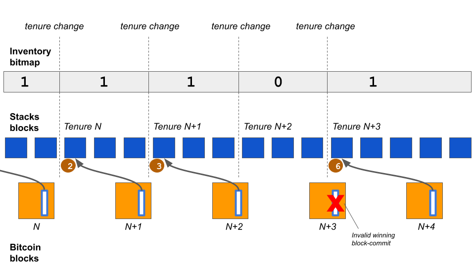

= Stacks: A Bitcoin Layer for Smart Contracts
:toc:
:sectnums:

[.normal]
Stacks is a Bitcoin layer for smart contracts; it enables smart contracts and decentralized applications to use Bitcoin as an asset in a trust-minimized way and settle transactions on the Bitcoin blockchain. The initial version of Stacks, launched in early 2021, introduced Bitcoin settlement of transactions, the Clarity language for safe contracts that can respond to Bitcoin transactions, and atomic swaps of assets with BTC. The next major proposed upgrade of Stacks, the Nakamoto release (expected 2024), adds important capabilities that will enhance the power of Stacks as a Bitcoin layer: (a) a decentralized, two-way Bitcoin peg to move BTC in/out of the layer and write to Bitcoin, (b) transactions secured by Bitcoin finality, and (c) fast transaction and block times. The resulting Stacks layer makes Bitcoin a fully programmable asset in a trust-minimized manner. This can make hundreds of billions of dollars of passive Bitcoin capital productive, unlock it for decentralized applications, and make Bitcoin the backbone of a more decentralized, open, productive economy.

== Design Summary

In this section, we give a brief overview of the high-level design of the Stacks L2. In the sections that follow, we will dig deeper into each of these decisions, defining precisely what is meant by each term and concept, and Stacks’ approach to these, along the way.

Bitcoin is the most decentralized, secure, and durable blockchain. BTC is a unique, widely held asset and the Bitcoin blockchain is the best final settlement layer for transactions. Applications that want to maximize decentralization and durability should use BTC as their asset and perform final settlement on the Bitcoin blockchain. However, to preserve its valuable properties, the Bitcoin blockchain is—by design—slow, minimal, and resistant to change. For example, it does not natively provide fully-expressive smart contracts or fast performance, so sophisticated applications cannot be built directly on it. The properties that make Bitcoin a superior form of decentralized money do not necessarily translate to being properties suitable for a decentralized application development platform. Therefore, BTC remains a passive asset and most applications are instead built on Ethereum and other layer-1 (L1) blockchains that have less powerful native assets than BTC.

Bitcoin layers extend the functionality and improve the performance of Bitcoin without changing the Bitcoin L1. Examples include fast payments (Lightning) and general smart contracts (Stacks and RSK). In its conservatism toward changes, Bitcoin is comparable to FedWire as a settlement layer and to TCP/IP as the internet protocol: Higher-level layers are built on top of these, with additional functionality and innovation, but the base remains simple and stable. Bitcoin layers enable sophisticated applications that require fully-expressive smart contracts, high performance, or greater privacy.

The Stacks layer for smart contracts has the following innovations that make it unique:

[horizontal]
S:: **S**ecured by the entire hash power of Bitcoin (Bitcoin finality).
T:: **T**rust-minimized Bitcoin peg mechanism; write to Bitcoin.
A:: **A**tomic BTC swaps and assets owned by BTC addresses.
C:: **C**larity language for safe, decidable smart contracts.
K:: **K**nowledge of full Bitcoin state; read from Bitcoin.
S:: **S**calable, fast transactions that settle on Bitcoin.

Bitcoin finality and fast transactions are two key components that are part of the Nakamoto release, and other properties are already live on Stacks. More specifically, the Nakamoto release of Stacks:

. *Secured by Bitcoin:* enables Bitcoin finalization for Stacks transactions; transactions that happen on the Stacks layer are secured by the entire hash power of Bitcoin. Meaning that to reverse these transactions, an attacker will need to reorg Bitcoin. Such transactions settle on Bitcoin and have Bitcoin finality. Further, the Stacks layer forks with Bitcoin, so any state on Stacks automatically follows the Bitcoin forks.
. *Trust-minimized Bitcoin peg:* lays the foundation for a novel decentralized, non-custodial, Bitcoin- pegged asset, sBTC, so smart contracts can run much faster and more cheaply using the Bitcoin-pegged asset with minimal counterparty risk. This also enables contracts on the Stacks layer to write to Bitcoin through the peg-out transactions without needing to rely on a centralized, closed set of entities. Atomic swaps and assets: Stacks already has atomic BTC swaps and enables Bitcoin addresses to own and move assets defined on the Stacks layer. Magic swaps <<magic-swaps>> and Catamaran swaps <<defi-swaps>> are examples of decentralized atomic swaps between BTC on Bitcoin L1 and assets on the Stacks layer that are already live. Further, users can own Stacks layer assets like STX, stablecoins, and NFTs on Bitcoin addresses and transfer them using Bitcoin L1 transactions if they prefer.
. *Clarity language:* supports Clarity, a safe, decidable language for provable smart contracts. With Clarity, developers can know with mathematical certainty what a contract can and cannot do, even before executing it <<clarity-lang>>. The decentralized peg contract will benefit from the safety properties of the Clarity language. Of particular note, Clarity WASM is a change being made to the Clarity VM that provides significantly faster execution times, along with creating a potential path to Rust and Solidity developers being able to write smart contracts on Stacks, although this work is not part of the Nakamoto release.
. *Knowledge of Bitcoin state:* has knowledge of the full Bitcoin state; it can trustlessly read Bitcoin transactions and state changes and execute smart contracts triggered by Bitcoin transactions. The Bitcoin read functionality helps to keep the decentralized peg state consistent with BTC locked on Bitcoin L1, amongst other things.
. *Scalable, fast transactions:* will provide high performance and scalability through several mechanisms, including faster Stacks layer blocks. Further, scalability layers like subnets can make different tradeoffs between performance and decentralization than the main Stacks layer.

If users can represent their Bitcoin with minimal counterparty risk on a decentralized Bitcoin layer, and smart contracts at the layer are able to read and write Bitcoin state in a trust-minimized way then that unlocks the deployment of hundreds of billions of dollars of latent Bitcoin capital into applications like decentralized Bitcoin-backed lending, Bitcoin-backed stablecoins, and more. All these applications increase demand for Bitcoin, making it more valuable and increasing its utility to the world. Increased application activity through Stacks can result in higher transaction fees for Bitcoin miners, aiding Bitcoin's security in the long term, as Bitcoin coinbase incentives must be replaced by transaction fees in the coming years. The Nakamoto release of Stacks, with trust-minimized writes and a decentralized Bitcoin peg, is a major step towards growing the Bitcoin economy.

The Stacks layer's consensus protocol, Proof of Transfer (PoX), inspired by Bitcoin's Proof of Work (PoW), is extremely energy-efficient and recycles PoW energy. The design of the decentralized peg is integrated with, and made possible by, PoX consensus. The Stacks layer's native token (STX) is essential to PoX consensus: STX is needed for (a) incentivizing Stacks miners to maintain the Stacks layer global ledger outside the Bitcoin L1, and (b) incentives for threshold signers that participate in the peg mechanism. Existing approaches to Bitcoin pegs, which lack a native token, cannot support a permissionless, open system and fallback to using custodians or trusting known federation members.

== Bitcoin Layers

The decentralization of trust is the primary innovation and promise of blockchains. Even in the world of cryptocurrencies, recent failures in 2022 have been of centralized entities, further highlighting the importance of systems that don't rely on “trusted” centralized intermediaries. Bitcoin is the most secure, durable, and valuable blockchain; it is already used as a store of value by millions of people. It is robust, "hard" money, with unprecedented non-custodial ownership and lack of inflation. The Bitcoin blockchain is also the best settlement layer for transactions, as it is the most decentralized, censorship-resistant, and durable blockchain.

However, Bitcoin is relatively slow and minimal by design and conservative in its evolution to preserve these powerful properties. It produces blocks on average every 10 minutes, with only 5-7 transactions per second. It does not provide native support for fully-expressive smart contracts and hence for sophisticated applications that can utilize its properties. The result is that Bitcoin has remained a passive rather than a productive asset. Despite its attractive and unique properties, it has not been a platform for applications besides a store of value and infrequent money movement.

Bitcoin layers change this. *Bitcoin layers extend the functionality and performance of the Bitcoin blockchain without requiring any changes to it.* Several Bitcoin layers exist today at different stages of development and maturity, such as Liquid for asset issuance, Lightning for fast payments, and Stacks and RSK for smart contracts. Lightning, for example, is a Bitcoin layer for scaling payments, enabling faster and cheaper payments in a trust-minimized manner. Lightning has a peer-to-peer design with no global interactions or state. Payments occur off- chain through peer-to-peer channels, which perform final net settlement on the Bitcoin main chain (via Bitcoin transactions) when the channels are closed. Peer-to-peer layers like Lightning do not provide global state or an execution environment for general computation, such as a virtual machine.

*Many applications, however, need smart contracts and a full execution environment.* They require global rather than just point-to-point interactions with global state, and they need the fuller expressive capability of smart contracts beyond what Bitcoin Script and Taproot provide on the Bitcoin main chain. Examples of applications that need fully-expressive smart contracts include Automated Market Makers (AMMs), liquidity pools, marketplace contracts for NFT trading, decentralized lending pools, and other known or yet-to-be-discovered applications in various disciplines. It is, therefore, essential to have Bitcoin layers that support fully-expressive smart contracts, and for those smart contracts to be able to use Bitcoin as their asset and the Bitcoin blockchain as the final settlement layer. This would generalize Bitcoin's capabilities while preserving full L1 security for the smart contract layer transactions.

It is important to define what is meant by a Bitcoin layer. While there are several nuanced opinions on what makes a system a Layer 2 on top of a Layer 1, these are the properties we believe comprise an ideal Bitcoin L2 and the assumptions we will be making throughout this paper:

1. Open-source and decentralized development process
2. Full VM support and ability to program with expressive, high-level languages
3. Fast transaction and block times (don't need to wait 10-30 minutes for Bitcoin blocks)
4. A trust-minimized way to move BTC between L1 and L2
5. BTC as the primary asset deployed in L2 apps
6. The ability to pay for L2 transactions in BTC
7. The ability to unilaterally withdraw your BTC back from the L2 with no counterparty risk

Stacks V1 had properties 1 and 2, but was missing the rest. Nakamoto brings properties 3, 4, and 5, with discussions and work currently underway to accomplish 6.

Currently, Lightning is the only L2 that has property 7, and the only way to truly take advantage of this is to run your own Lightning node, a complex undertaking few users engage in. Furthermore, Lightning is missing property 2, which means we cannot unlock any additional functionality beyond what that Bitcoin L1 is already capable of.

It's important to acknowledge that Bitcoin L2s have fundamentally different goals than L2s on other L1s like Ethereum. While the primary motivation for L2s on Ethereum is to enhance scalability, Bitcoin L2s serve the purpose of enhancing both scalability and functionality.

This means that the Bitcoin layer cannot verify the validity of transactions that occur on L2s like Stacks. Instead the VM for that layer is responsible for transaction processing and verification, and settling those transactions down to Bitcoin so that they share the same history and finality.

This limitation may change with the introduction of new opcodes but that is likely years away. Until then, we view it as the responsibility of Bitcoin layers to build iteratively, offering the most functionality with the least counterparty risk, and update as new technology emerges and new functionality becomes possible.

There is very interesting work <<bitvm-wg>> being done in the areas of Bitcoin rollups and projects like BitVM <<bitvm>> that are bringing us closer to this possibility.

=== Bitcoin Layers for Smart Contracts

Fully-expressive smart contracts enable developers to build any application logic that they desire. Such smart contracts require global accessibility and persistent storage for their state  and code (whether compiled or not). The Bitcoin blockchain does not allow for arbitrary contract publishing and storing complex contract state, so contract logic and state must be stored and executed outside the Bitcoin L1. Because smart contracts should be immutable, they must be published on a global ledger that is immutable i.e., a separate blockchain.

Existing attempts to enable fully-expressive smart contracts in the broader Bitcoin ecosystem have focused on the sidechain approach. Sidechains are a type of Bitcoin layer that can support smart contracts, e.g., RSK and Liquid. In sidechains, BTC is “pegged-in” to a different blockchain (the sidechain) as a derived asset pegged 1:1 in value to BTC. Smart contracts run on that other blockchain and operate on the pegged asset there, without much interaction with the Bitcoin blockchain. BTC is “pegged out” to the Bitcoin blockchain when desired. The only connection with Bitcoin is through the peg-in and peg-out operations and possibly through leveraging Bitcoin mining power in merged-mining approaches. Smart contracts on the sidechain typically do not interact with Bitcoin transactions and BTC; there is no record of them on the Bitcoin blockchain. This differs from Bitcoin L2 layers like Stacks, that can directly interact with Bitcoin transactions and settle transactions on Bitcoin L1. As of 2023, sidechains in the Bitcoin ecosystem (Liquid, RSK, etc) don’t implement open-membership Bitcoin peg-outs. They rely on a federation of known, trusted entities or centralized custodians to do this. Nomic has implemented a decentralized Bitcoin bridge/peg in the Cosmos ecosystem which is at an early stage. Projects like tBTC <<tbtc>> have attempted decentralized approaches to Bitcoin-pegged assets for Ethereum. Again, the core difference between these projects in external ecosystems like Ethereum and Cosmos is that the smart contract layer has no real connection to Bitcoin.

RSK uses merged mining for block production and consensus, whereas Liquid uses a known federation of entities. The security of a merge-mined sidechain depends on how many Bitcoin miners also choose to mine the sidechain. If all do, the sidechain is very secure. However, if only some do—or during periods when only some do—it can be insecure as it becomes easy for a minority of Bitcoin miners to attack the sidechain (for example, the Namecoin chain was at risk of such attacks for long periods <<ma-thesis>>). Mining a smart contract chain is not the same as mining Bitcoin, as it requires running arbitrary contracts (programs) and dealing with much larger quantities of data and logic, not just solving hashes. Once there is substantial smart contract traffic, which current Bitcoin sidechains have not experienced, this can either become less attractive to miners or can reduce the decentralization of Bitcoin mining. So, relying on Bitcoin miners for mining smart contract layers may not be a good long-term idea.

Next we’ll cover some of the most desirable properties of a smart contract Bitcoin L2 and then take a look at how Stacks addresses these.

=== Desirable Properties of Smart Contracts for Bitcoin

We've covered the properties that would comprise an ideal Bitcoin L2, now let's dig a bit deeper and explore exactly how smart contracts for Bitcoin would work. Since Bitcoin does not support fully-expressive smart contracts natively, how should we implement a Bitcoin layer for general-purpose smart contracts that use BTC as their asset and settle on the Bitcoin blockchain? One way to look at this is by comparing what would happen if Bitcoin natively supported smart contracts (like Ethereum does). Such contracts would, of course, have their code and state on the Bitcoin chain, i.e., on a global ledger. They would also:

1. have a ledger secured by the entire hash power of Bitcoin,
2. be triggered to execute by normal Bitcoin transactions,
2. be able to write (broadcast) signed transactions to the Bitcoin blockchain in a decentralized, trustless manner, i.e., without relying on any fixed set of entities,
3. have transactions settle on the Bitcoin chain, so a record of all smart contracts and transactions is verifiable in a trustless manner by anyone, like other Bitcoin transactions are, and
4. be subject to Bitcoin short-lived forks (i.e., if the Bitcoin chain experiences short-lived forks, then (a) only the contracts and transactions that end up on the canonical Bitcoin fork are valid, and (b) contracts and transactions should not become inconsistent with Bitcoin as a result of forks on Bitcoin).

While these are desirable characteristics, we also want mechanisms to achieve higher  transaction throughput and lower latency of transaction completion than Bitcoin allows. Evaluating the sidechain approach against the properties of hypothetical native Bitcoin smart contracts, we see that it does not satisfy a number of the properties:

1. The Bitcoin layer or its smart contracts are not secured by the full hash power of Bitcoin, unless every Bitcoin miner mines the sidechain too.
2. Its smart contracts are not triggered by ordinary Bitcoin transactions (in current sidechain implementations).
3. They can write Bitcoin transactions, though not in a trustless manner (given federated pegs).
4. Other than peg operations, their transactions don't settle on the Bitcoin chain but are entirely separate, and transaction settlements cannot be verified on Bitcoin.
5. They do not fork with Bitcoin as there is no close ongoing relationship between them, and they are largely unaware of Bitcoin forks.

The fact that a sidechain operates independently of Bitcoin, other than the peg, enables it to operate with higher transaction throughput and lower latency, largely unconstrained by the speed of Bitcoin, but without transactions settling on the Bitcoin blockchain. *The Stacks Bitcoin layer is designed to come as close to these desirable properties of hypothetical native Bitcoin smart contracts as possible but also enables high performance.*

This is an area of active exploration and experimentation, and the design of the Nakamoto release, laid out in the rest of this paper, is one of these experiments and a step forward to building a decentralized economy and financial system with Bitcoin at the foundation. In the next section, we present the design of the Stacks Bitcoin L2 and examine how it functions with regard to these ideal properties of a Bitcoin smart contract layer.

== The Stacks Bitcoin L2

Stacks is a different type of Bitcoin L2 for smart contracts than sidechains, with a deeper, ongoing connection to Bitcoin. The Stacks L2 enables applications and smart contracts to use BTC as their asset or money and to settle their transactions on the Bitcoin main chain. *The goal of the Stacks L2 is to grow the Bitcoin economy, by turning BTC into a productive rather than passive asset, and by enabling various decentralized applications.* Like sidechains such as RSK and Liquid, the Stacks layer has its own global ledger and execution environment, to support smart contracts and to not overwhelm the Bitcoin blockchain with additional transactions. However, the Stacks layer is unique as it has most of the ideal  properties that native Bitcoin smart contracts would have, but it does this without needing to add additional functionality or complexity to Bitcoin. It also provides mechanisms for higher performance and additional functionality, such as fast block times and the decentralized peg.

Unlike RSK and Liquid, Stacks also *has its own native asset (STX)*. This is not merely a governance or speculative token, but it is central to the consensus mechanism of the Stacks Bitcoin layer, discussed below, and is essential for two key goals: (i) it incentivizes mining of Stacks blocks with a “new block subsidy,” which is critical since transaction fees are not enough to sustain a ledger at least in the early days (as is the case with Bitcoin itself), and (ii) it serves as a liveness incentive and the basis for the economically secured decentralized Bitcoin peg. Despite having its own native asset, the Stacks layer helps grow Bitcoin and does not compete with Bitcoin.

The Stacks layer relies on STX and on BTC for its *novel consensus mechanism, called Proof of Transfer (PoX)*, that utilizes both the Stacks and Bitcoin layers. PoX is similar in spirit to Bitcoin's Proof of Work (PoW) consensus: Like how Bitcoin PoW miners spend electricity and are rewarded in BTC, Stacks PoX miners spend (already mined) BTC and are rewarded in STX. Like PoW, PoX uses a Nakamoto-style single-leader election: PoX miners bid by simply spending BTC, and they have a bid-weighted random probability of becoming a leader. Leader election happens on the Bitcoin chain and new blocks are written on the Stacks layer. In this way, *PoX reuses work already done by Bitcoin miners*, and does not consume any significant amount of additional electricity: only the cost of running normal laptops/computers for Stacks nodes to bid using BTC.

*Like PoW, PoX is permissionless:* Anyone can be a Stacks miner, as long as they are willing to spend BTC. Also, any STX holder can lock their STX (called “stacking”) to participate in PoX consensus, and earn Bitcoin rewards for doing useful work for the system, i.e., for being a signatory for the decentralized Bitcoin peg. In keeping with Bitcoin ethos, Stackers are rewarded for their positive contributions to the system and inhibited by economic disincentives from behaving poorly (but unlike in bonded Proof of Stake systems, they are not "slashed"). Finally, the nature of PoX consensus is such that the price ratio between BTC and STX is continually recorded and available on-chain, serving as an on-chain Bitcoin price oracle. This is valuable for the decentralized peg, removing the need for an external oracle, as described in the companion paper about the peg.

Stacks uses *Clarity, a much more secure language* than Ethereum's popular Solidity language, for the Stacks main layer and the decentralized Bitcoin peg. Clarity is a decidable language (not Turing-complete), meaning that you can know, with certainty, from the code itself what the program will do, and code correctness can be verified by software. Clarity is an interpreted rather than compiled language, so the source code of smart contracts is visible on the blockchain for verification by human beings, and it has post-conditions that provide additional execution safety.

Using the Stacks layer, developers can build any application they can build on other smart contract platforms—like Ethereum, Solana, Avalanche, etc. — but using BTC as their asset/money and settling their transactions on the Bitcoin blockchain.

ClarityWASM is an upgrade to the Clarity VM that compiles Clarity code down to WebAssembly, this provides significant speed enhancements in contract execution. But does this break the security benefit of Clarity not being a compiled language?

The primary difference between how the Clarity VM and EVM handle smart contract code comes down to what is hosted on-chain. In Solidity, developers will compile the code locally and the bytecode is what is actually stored on-chain. With ClarityWASM, developers will still upload their Clarity code directly on-chain, it is compiled to WASM on-the-fly, so there can be no discrepancy between what a developer writes in their local environment and what is hosted on-chain. With Clarity contracts, what you see is still what you get.

While Clarity has several advantages over existing smart contract languages like Solidity and Rust, one potential roadblock for developers exploring building on Stacks is the learning curve of a new language. The ClarityWASM upgrade provides potential routes for creating SolidityWASM and RustWASM compilers that would allow developers already familiar with these languages to write smart contracts on Stacks. While specific technical implementations and security models (say for how a Rust contract might call into a Clarity contract) still need to be fleshed out, it provides an interesting path for including a broader pool of smart contract developers in the Stacks ecosystem.

In the rest of this section, we first examine how the Stacks layer rates with regard to the properties of hypothetical native Bitcoin smart contracts that we discussed earlier, and touch upon how it provides higher performance. We discuss how the fact that Stacks has a native token helps Bitcoin rather than hurting it. We then describe the decentralized two-way Bitcoin peg a little further, and we discuss the related security and forking rules of the Stacks chain in the new release. Finally, we discuss additional capabilities for performance and versatility, including subnets, future EVM compatibility, and the potential for ZK-rollups.

=== How Stacks Leverages the Connection to Bitcoin

Remember that above we used the standard of creating a L2 and smart contract execution environment that has as many of the security properties of Bitcoin as possible, without adding any additional functionality or complexity to Bitcoin. Here's how Stacks achieves this:

* *Bitcoin finality and security:* Stacks blocks have 100% Bitcoin finality; i.e., they are secured by the Bitcoin blockchain and the entire hash power of Bitcoin (not only that of Stacks miners, and not like in merged mining). Beyond that point, the Stacks layer does not allow forks, so to reorganize the Stacks transactions would require successfully attacking Bitcoin with a deep reorg attack, which is extremely expensive and logistically difficult to pull off. It is worth noting that because Stacks blocks are recorded on Bitcoin blocks, information about them is publicly visible on the Bitcoin blockchain as they are produced, making it easy to detect attacks and reorgs and take countermeasures, and making hidden block attacks (such as selfish mining) much more difficult than on Bitcoin itself.
* *Settlement and verification on Bitcoin.* Hashes of all Stacks layer smart contracts and transactions settle on the Bitcoin blockchain. This is a necessary consequence of the operation of Stacks' PoX consensus protocol, and it happens dynamically, every Bitcoin block, as part of consensus.
* *Forking with Bitcoin.* The PoX protocol also gives the Stacks layer the desirable property of forking with Bitcoin. Bitcoin forks are naturally adapted to and "taken in stride" by the Stacks layer, such that the canonical Stacks chain is always found on the canonical Bitcoin chain, and smart contracts, transactions and the peg automatically stay in sync and uncorrupted even if Bitcoin forks. As a result of these properties, any suggested version of the Stacks ledger can be fully, independently verified by looking at the Bitcoin main chain, including and accounting for all forks, thus providing an additional layer of security and durability. That is, a user can independently verify which fork history of Stacks is correct simply by running an independent Bitcoin node.

This tight connection to Bitcoin, in addition to providing several security benefits, also gives Stacks unique capabilities in regards to reading and utilizing Bitcoin state directly inside smart contract code.

* *Smart contracts being triggered by Bitcoin transactions:* Smart contracts on the Stacks layer can read Bitcoin state and can be triggered by standard Bitcoin transactions. This is because Stacks nodes also run Bitcoin nodes as part of consensus, and they read and index Bitcoin state eagerly.
* *Bitcoin writes:* The sBTC Bitcoin peg mechanism can write Bitcoin transactions to the Bitcoin chain in a trust-minimized manner. Stacks also allows applications to deploy BTC directly from the Bitcoin chain; e.g., users can perform atomic swaps between BTC and other assets (like stablecoins) on the Stacks layer. The Stacks layer also supports decentralized, non-custodial peg-outs and peg-ins of a 1:1 pegged BTC: BTC can be pegged in to the Stacks layer, smart contracts and other operations can operate upon it faster there, and it can be pegged back out onto the Bitcoin main chain. Unlike the derived assets of sidechains, like L-BTC in Liquid and RBTC in RSK, this peg is not reliant on a fixed federation or a federation of multisig hardware wallets for its peg-out. Rather, it achieves economic security through an open-membership set of signatories, in a manner integrated with the Stacks consensus protocol. Using sBTC with Nakamoto’s faster block times allows smart contracts to operate with much lower latencies and higher throughputs than using BTC directly on the Bitcoin blockchain.

=== Synergies versus Competition with Bitcoin

The Stacks Bitcoin layer clearly relies on Bitcoin in a fundamental way. At the same time, the argument can be made that because it has its own token (STX), it pulls value away from Bitcoin. While this may be true of other tokens that directly compete with Bitcoin, it is not true of STX as the Stacks layer helps grow the Bitcoin ecosystem rather than compete with Bitcoin.

We mentioned earlier that the STX token is not merely a governance or speculative token, but it is necessary to the PoX consensus mechanism of the Stacks Bitcoin layer and essential to maintain an open network, as it incentivizes miners to mine new Stacks blocks.

The token is thus essential to the goal of building and growing decentralized applications that make Bitcoin productive and more useful. Such applications *increase demand for Bitcoin block space and make Bitcoin more valuable*. These applications and other activities that can be performed on Bitcoin using the Stacks layer also *result in higher transaction fees for Bitcoin miners*, in two ways: (a) the applications directly cause more transactions on the Bitcoin chain, which generate fees, and (b) Stacks mining and settlement on Bitcoin result in high-fee BTC transactions. These transaction fee incentives for Bitcoin miners become increasingly important as the Bitcoin coinbase rewards (or "new block subsidies") are reduced with "Bitcoin halvings" every four years and Bitcoin miners must rely more on transaction fees. Finally, enabling decentralized applications with Bitcoin gives users fewer reasons to use other chains and monetary assets that compete with Bitcoin.

The Stacks project was started by developers and computer scientists who have a long history of building in the Bitcoin ecosystem (some early developers of Stacks built the largest used early OP_RETURN based on-chain Bitcoin protocols <<virtualchain>>).

=== The Decentralized, Permissionless Two-way Bitcoin Peg

Smart contracts that run on Bitcoin layers and truly use BTC as their asset must be able to not only read but also modify Bitcoin state. This means the signing of Bitcoin transactions with private keys by external software must be managed somehow. This “Bitcoin write” problem is difficult for transactions initiated by (external) smart contracts. Also, to perform all individual transactions and state updates on the Bitcoin chain in this way would be very slow and lead to a lot of long waits for transactions to complete. For performance, we should reduce the number of times transactions must be sent on Bitcoin and wait for completion.

Pegged Bitcoin assets aim to achieve these goals. A user locks an amount of BTC in a "peg wallet" on the Bitcoin chain and an equivalent amount of the pegged asset is issued on the other chain/layer (the "deposit" operation). The pegged asset is used as often as desired on that layer (which maintains its own state), including by smart contracts, modifying state on that layer with higher performance. When desired, an amount of the pegged asset is destroyed and an equivalent amount of BTC released back on Bitcoin, i.e., unlocked from the peg wallet and sent to a specified Bitcoin address (the "withdrawal").

On Stacks, this system is known as sBTC. sBTC is a critical component of Stacks and has its own dedicated section below.

=== Security, Block Production, & Forking Rules

The Stacks layer will receive a *major upgrade to its security model with the Nakamoto release.* The current version of Stacks has a separate security budget from Bitcoin.  This security budget is defined by the BTC capital spent by Stacks miners. With the Nakamoto release, all of the Stacks chain history will have Bitcoin finality, regardless of the Stacks mining budget: *100% of Bitcoin mining power will secure the immutability of the Stacks layer.* Once a transaction is confirmed, reversing it will be at least as hard as reversing a Bitcoin transaction. The Stacks blockchain no longer forks on its own. In addition, the Nakamoto release brings Bitcoin fork and MEV resistance to the Stacks chain as well.

In the proposed design for Nakamoto, if there is a Bitcoin reorg, then Stacks transactions which remain valid after the fork will be re-mined in the same order they were in before. However, transactions that become invalid as a result of a Bitcoin fork are dropped. This feature is not consensus-critical and will be implemented after the initial Nakamoto release.

Bitcoin miner MEV is a problem that the Stacks chain has faced in recent months. Nakamoto alters the leader election algorithm to ensure that Bitcoin miners do not have an unfair advantage as Stacks miners. They must spend competitive amounts of BTC to have a chance of earning STX. Before Nakamoto, it was possible for a miner to censor Stacks block commit transactions so that only the miner's would be picked up, which occasionally resulted in a pool operator earning a STX coinbase reward even though they only spent a trivial amount of BTC.

This new security model is a major upgrade for the Stacks layer and is highly differentiated from methods like merged mining or federated designs. Stacks achieves these goals with the Nakamoto release with the following design features:

==== Decouple Stacks tenure changes from Bitcoin block arrivals

In previous versions of Stacks, as well as in the Nakamoto release, miners take turns appending blocks to the Stacks blockchain. The next miner is selected by a process called cryptographic sortition, and the miner has the duration of the Bitcoin block (its tenure) to announce a new block state. This design of tight coupling to Bitcoin blocks is a major part of Stacks security but also caused very slow block times, which means very slow transaction confirmation time for users.

In Nakamoto, miners produce many Stacks blocks per Bitcoin block instead of one, and require the next miner to confirm all of them. This achieves very fast block times, on the order of seconds. We'll cover how Nakamoto achieves this while maintaining Bitcoin finality in the “High Performance with Bitcoin Finality” section below.

==== Stackers heavily involved in mining process

In order to earn their PoX payout, Stackers have a few additional roles to play. First, Stackers need to collectively validate, store, sign, and propagate each Stacks block the miner produces before the next block can be produced. In Nakamoto, cryptographic sortition only selects a new miner, it does not give them the power to orphan confirmed transactions as in previous versions of Stacks. This ensures that miners do not produce forks and are able to confirm all prior Stacks blocks prior to selection.

The Stackers are the ones who carry out the tenure change of miners which means they agree on the last-signed block from the current miner and agree to only sign blocks from the new miner which descend from this last-signed block. Stackers prevent miners from mining forks during their tenure and ensure they begin their tenures by building on the canonical chain tip, further preventing forking.

==== Stacks miners required to commit the indexed block hash of the first block produced by the last Stacks miner

If Stacks blocks were previously anchored to Bitcoin blocks as a result of miners producing new blocks in lockstep with Bitcoin blocks and recording a hash in each block commit Bitcoin transaction, how do we achieve 100% Bitcoin finality without anchoring each Stacks block?
In previous versions of Stacks, a block-commit transaction (the Bitcoin transaction a Stacks miner makes to “commit” a Stacks block to the Bitcoin chain) only contains the hash of the Stacks block. With Nakamoto, miners will also be required to include a consensus hash of all previously-accepted Bitcoin transactions that Stacks recognizes, in addition to the hash of the new block itself.

This anchors the Stacks chain history to Bitcoin up to the start of the previous miner’s tenure (1 Bitcoin block ago), and all causally-dependent Bitcoin state that Stacks has processed. This achieves several things at once: ensures Bitcoin finality, resolves miner connectivity issues by putting fork prevention on Stackers, and allows nodes with up-to-date copies of the Stacks chain state to identify which Stacks blocks are affected by a Bitcoin reorg and recover the affected Stacks transactions.

=== High Performance with Bitcoin Finality
The initial version of the Stacks layer (2021) produces blocks at the speed of Bitcoin, which is unpredictable and slow (a block every 10 minutes, on average). In the Nakamoto release, the Stacks layer block production mechanism changes to produce much faster Stacks blocks while still maintaining Bitcoin finality.

Most modern smart contract L1s have low-latency block production mechanisms, which means application users expect their transactions to get confirmations within seconds.

On the other hand, block production in Bitcoin's Proof-of-Work (PoW) is both inherently unpredictable, given randomness of the hash function, and slower, as Bitcoin optimizes for decentralization by allowing ample time for block propagation to nodes with modest network connections. Further, Bitcoin allows forking and gives the network ample time to resolve short- lived forks.

The Stacks layer aims to give application users the best of both worlds: *fast transactions with Bitcoin finality.* Users get faster confirmations as Stacks blocks are produced in seconds, while still benefiting from 100% of Bitcoin's hash power.

We briefly covered the block production mechanism that Nakamoto provides above, but let's spend a bit more time discussing it, as it is key to understanding how Stacks achieves the best of both worlds: fast blocks secured by 100% of Bitcoin's hashpower.

Stackers subsume an essential role in the Nakamoto system that had previously been the responsibility of miners. Before, miners both decided the contents of blocks, and decided whether or not to include them in the chain (i.e. by deciding whether or not to confirm them). In this system, miners only decide the contents of blocks. They do not get to decide whether or not they are included in the chain. Instead, Stackers decide whether or not the block is included in the chain. However, Stackers do not get to decide the contents of blocks without becoming miners. This separation of responsibilities is necessary to make the system function reliably without forks.

Miners create blocks at a fast cadence, about once every five seconds, send them to Stackers for validation and signing, and if Stackers reach at least 70% quorum on the block, the block is replicated to the rest of the peer network. The process repeats until the next cryptographic sortition chooses a different miner to produce blocks.

Miners submit their candidacy to produce blocks by sending a block-commit transaction to the Bitcoin chain. In Nakamoto, these block-commit transactions include the indexed block hash of the previous miner's first-ever produced Stacks block.

The figure above illustrates the relationship between Bitcoin blocks and Stacks blocks. Each winning block-commit contains the hash of the very first Stacks block in the previous tenure.

This relationship between Stackers, miners, Bitcoin blocks, and Stacks blocks is what maintains Bitcoin finality while allowing miners to rapidly produce Stacks blocks. Bitcoin finality is achieved because at every Bitcoin block N + 1, the state of the Stacks chain as of the start of tenure N is written to Bitcoin. Even if at a future date all of the former Stackers’ signing keys were compromised, they would be unable to rewrite Stacks history for tenure N without rewriting Bitcoin history back to tenure N + 1.

Subnets provide an additional avenue for further experimentation and performance increases if desired.

== sBTC: A Decentralized Bitcoin Bridge

=== Overview

sBTC is a decentralized, trust-minimized two-way Bitcoin peg between Bitcoin and the Stacks blockchain. Implemented as a SIP-010 compliant fungible token on Stacks, sBTC enables Bitcoin holders to securely represent their BTC as tokens on the Stacks chain without relying on a single trusted entity. This bridge allows Bitcoin to be seamlessly integrated into the Stacks ecosystem, significantly expanding Bitcoin's utility through programmable smart contracts while maintaining its fundamental security properties.

The system combines the computational capabilities of the Stacks blockchain with Bitcoin's reliability and security. Users can deposit BTC into the protocol, conduct transactions using sBTC on the Stacks blockchain, and redeem their sBTC tokens for the underlying BTC at any time. The protocol maintains security through a decentralized signer network, eliminating single points of failure and reducing trust requirements.
First, we’ll describe how the two core operations of sBTC (deposit and withdrawal) work, and then we’ll dig into each component of sBTC to see how they all work together to conduct these operations.

=== Core Operations

==== Deposit Process

The sBTC deposit process facilitates the conversion of BTC into sBTC tokens through a multi-step process that completes within a maximum of three Bitcoin blocks (although this process usually happens in a single block). This process ensures both the security of users' funds and the maintenance of the 1:1 peg between BTC and sBTC.

To initiate a deposit, a Bitcoin holder creates a transaction containing a special UTXO that can be spent by the sBTC Signers. This transaction includes an OP_DROP payload that specifies two crucial pieces of information: the recipient's Stacks address where the sBTC should be minted, and the maximum fee the depositor is willing to contribute toward UTXO consolidation. After broadcasting this transaction, the user submits proof of their deposit through the Deposit API.

In practice, this transaction would be generated by the sBTC Bridge application or a third-party application that would implement this logic into their frontend user interface. Users would not be expected to construct these transactions manually.

sBTC Signers continuously monitor for these deposit transactions using the Deposit API (known as Emily<<emily>>). When a deposit is initiated, in addition to conducting the actual Bitcoin transaction, users will use the Emily API to notify the sBTC signers that the deposit occurred.

Upon detecting the deposit transaction, the sBTC Signers validate the UTXO format and parameters. If the validation succeeds, the Signers create a Bitcoin transaction that consumes the deposit UTXO and consolidates it into the main sBTC UTXO (discussed below). Following successful consolidation, the Signers execute a mint function call in the .sbtc Clarity contract, creating the corresponding sBTC tokens on the Stacks blockchain.

In the case that signers do not pick up the deposit, the deposit mechanism includes a safety feature: deposit UTXOs can be spent under one of two conditions. Either the signer set spends the UTXO as part of normal operations, or after a predetermined number of Bitcoin blocks, the user can reclaim their BTC. This ensures users maintain ultimate control over their funds even in the event of signer set unavailability.

==== Withdrawal Process

The withdrawal process allows users to convert their sBTC tokens back into BTC through a coordinated series of operations on both blockchains, completing within six Bitcoin blocks. This process ensures secure and verifiable conversion while maintaining the system's integrity.

Users initiate withdrawals by calling the `withdraw-request` function in the .sbtc contract, specifying their desired Bitcoin withdrawal address. This function transfers the specified amount of sBTC to the contract and mints a non-transferable locked-sBTC token as a placeholder, ensuring the funds remain accounted for during the withdrawal process.

The sBTC Signers evaluate each withdrawal request according to predetermined criteria. Upon acceptance, the withdrawal enters a mandatory waiting period of six Bitcoin blocks to ensure transaction finality and prevent potential blockchain reorganizations from compromising the withdrawal process. After this period, the Signers create and broadcast a Bitcoin transaction that fulfills the withdrawal by transferring BTC from the main sBTC UTXO to the user's specified address.

Once the Bitcoin transaction confirms, the Signers execute a smart contract call to mark the transaction as fulfilled and burn the user's locked-sBTC, maintaining the system's 1:1 peg. In cases where a withdrawal request is rejected, the Signers call the `withdraw-reject` function, which returns the original sBTC to the holder and records the signer votes for transparency.

==== Deposit and Withdrawal Confirmation Times

In the previous section, we mentioned that deposits can occur within 3 blocks, but withdrawals take 6 blocks. The key reason for this difference lies in how Stacks block production works and how it is connected with Bitcoin.
Due to Proof of Transfer (PoX) consensus, the Stacks blockchain maintains synchronization with Bitcoin by following its fork choice rule. When Bitcoin experiences a reorganization, Stacks reorganizes in parallel, ensuring all Stacks blocks reference Bitcoin's canonical chain. This synchronization mechanism directly impacts sBTC operations.
Withdrawals require a six-block waiting period because they trigger irreversible Bitcoin transactions. This delay ensures that the withdrawal transaction won't be reorganized out of the Stacks chain before the sBTC signers execute the corresponding Bitcoin transaction. Without this waiting period, a chain reorganization could result in BTC being released while the corresponding sBTC remains in circulation.
Deposits, however, can be processed more rapidly because they maintain consistency even during chain reorganizations. If a deposit transaction is reorganized out of the Bitcoin chain, the Stacks reorganization will automatically remove the corresponding sBTC minting operation. This natural synchronization maintains the protocol's 1:1 backing without requiring extended confirmation times.
While deposits can be processed quickly by the protocol, users may still choose to wait for additional Bitcoin block confirmations to ensure the finality of their minted sBTC tokens. The finality of minted sBTC is equivalent to the finality of the Bitcoin block containing the deposit transaction.

=== System Components

==== Signer Network

The sBTC protocol operates through an elected network of 14 independent entities that collectively manage the system through a democratic process. The mature sBTC protocol will move from an elected Signer set to a fully open, decentralized, rotating Signer set.

This signer set forms the backbone of the protocol's security and operational model, with each signer holding exactly one vote in the network's decision-making process.

The system employs a threshold signature scheme requiring approval from at least 70% (11 out of 15) of the signers for any operation to proceed. This design creates a security model with two key properties: the system maintains liveness as long as 70% of signers remain online and honest, while security against theft is preserved as long as at least 30% of signers remain honest.

Signers bear significant responsibilities in maintaining the protocol's operation. They must process deposits and withdrawals, manage UTXO consolidation, handle key rotations, and maintain high operational security standards. The geographic distribution of signers is carefully considered during selection to ensure network resilience against regional failures or regulatory changes.

==== sBTC Peg Wallet

The sBTC protocol utilizes a single-UTXO design for its peg wallet, which holds the entire BTC balance backing the sBTC tokens in circulation. This architectural choice simplifies wallet management and reduces transaction complexity while maintaining security through the threshold signature scheme.

The signer set collectively manages this UTXO, handling all aspects of its operation including deposit consolidation, withdrawal execution, and key rotation events. They also manage transaction fees, ensuring proper fee deduction from users for Bitcoin network operations while maintaining appropriate minimum withdrawal amounts to cover these costs.

==== Smart Contract Infrastructure

The .sbtc contract suite forms the protocol's operational core on the Stacks blockchain. These Clarity smart contracts implement the SIP-010 fungible token standard and manage all aspects of sBTC operation on Stacks. The contracts handle deposit acceptance and token minting, withdrawal requests and token burning, and maintain the locked-sBTC placeholder system during withdrawals.

The smart contract infrastructure also manages the signer set, implementing the voting and coordination mechanisms necessary for decentralized operation. This includes handling signer set updates and key rotations through transparent, on-chain processes.

==== API Layer

The API layer of sBTC (known as Emily) serves as the interface for the sBTC bridge, facilitating communication between protocol users and sBTC signers. Named after Emily Warren Roebling, who supervised the Brooklyn Bridge construction, the API monitors and tracks the status of cross-chain operations within the sBTC ecosystem.

Emily does not effect user’s ability to convert their sBTC to Bitcoin because in the event that Emily were to go offline, withdrawals would still be functional because users only need to call the sBTC contract on Stacks to initiate the process.
The API serves two primary user groups - sBTC users and sBTC application developers - by providing comprehensive operation tracking and status updates. Its core functionalities include:
Deposit Tracking: Monitoring the conversion process from BTC to sBTC
Withdrawal Tracking: Tracking the conversion of sBTC back to BTC
Status Updates: Providing real-time operation status information
Historical Data: Maintaining queryable records of past operations
The API tracks all sBTC operations through four distinct states:
PENDING: Initial state when an operation is first initiated
ACCEPTED: Indicates signer approval of the operation
CONFIRMED: Marks successful completion and blockchain confirmation
FAILED: Indicates operation failure
For deposits, the API coordinates the following sequence:
Records the user's deposit submission as PENDING
Tracks signer validation and voting
Updates to ACCEPTED upon signer approval
Monitors Bitcoin transaction processing
Tracks sBTC minting on Stacks
Updates to CONFIRMED upon completion
For withdrawals, the API manages:
Records the withdrawal initiation from the sBTC contract as PENDING
Monitors signer acceptance or rejection
Updates to ACCEPTED upon approval
Tracks Bitcoin transaction processing
Monitors sBTC burning on Stacks
Updates to CONFIRMED upon completion

== Future Work: Bitcoin Rollups, BitVM, DLCs and the Stacks Layer

There has been a surge in experimentation and innovation on various ways to build on top of Bitcoin, and many of these present opportunities to work with the Stacks layer to improve functionality or provide additional interfaces and security models for different users depending on their preferences.

BitVM<<bitvm>> is one of the most recent ideas to enter the Bitcoin L2 sphere. Recall the 7 properties of an ideal Bitcoin L2 discussed above. The only one that Stacks does not meet is property 7: unilateral exit.

A future integration with BitVM unlocks the potential for Stacks to fulfill property 7 and allow for unilateral exit from the L2. BitVM essentially uses fraud-proofs to allow challenge-response games to be executed and verified at the L1.

In the context of Stacks, and specifically the trust-minimized bridge via sBTC, this means that honest participants can challenge dishonest actions, and it only requires a single honest participant to issue that challenge and prove (thus rejecting) the dishonest action.

BitVM is still in the early stages, and significant R&D is required, but this presents an exciting opportunity to integrate Stacks with BitVM to essentially bring Stacks to an honest 1 of N assumption.

ZK rollups for Bitcoin present another interesting research area. With some changes to Bitcoin, potentially as soft forks, rollups for Bitcoin may be enabled in the future [bitcoin-rolllups]. The Stacks layer, with its full execution environment and more rapid pace of upgrades than Bitcoin, presents an excellent venue to experiment with Bitcoin rollups and other scalability technologies like fraud proofs. A rollup or fraud proof published at the Stacks layer can benefit from 100% of Bitcoin hash power as the relevant transactions/data reach Bitcoin finality. Moreover, the Stacks layer can serve as a natural storage layer for any data needed for rollups, with settlement on the Bitcoin blockchain.

Rollups and fraud proofs on the Stacks layer itself can be deployed today, including using the Bitcoin-pegged sBTC. In fact, there is some on-going work on a prototype implementation of Arbitrum-style fraud proofs for the Stacks layer. The Bitcoin-pegged asset sBTC can be used in these rollups and fraud proof systems, so that users can enjoy the benefits of rollups and fraud proofs (such as privacy and scalability) while using Bitcoin as their asset via sBTC. In the short-term, say the next two or three years, rollups on the Stacks layer are much more practical than rollups directly on the Bitcoin L1, since Bitcoin is historically cautious and slow to adopt any changes. However, even in the long-term it might be beneficial to use rollups using sBTC on the Stacks layer instead of, or in addition to, BTC on the Bitcoin chain. This is because of Maximal Extractable Value (MEV) and data storage.

To exploit MEV incentives for rollups, it is far more economical to do reorderings/reorgs on the Stacks layer (at least for up to 6 blocks) in Stacks rollups than it is to do them at the Bitcoin level. With direct Bitcoin rollups, the MEV incentives will need to be handled directly at the Bitcoin level, which makes Bitcoin mining incentives much more complex than the current Bitcoin situation of fairly straightforward incentives. If the Stacks layer is used for rollups—for example, with sBTC—neither MEV incentives nor potential attacks are directly exposed to the Bitcoin blockchain (indirectly any Bitcoin layer that settles on Bitcoin will have some consequences for Bitcoin miner incentives).

For storage for rollups data, it is better to use an external layer like Stacks than to grow the size of the main Bitcoin chain. Rollups and fraud proofs remain a relatively early yet exciting area for Bitcoin.

One other concept that is often mentioned when discussing the expressivity of Bitcoin and being able to build decentralized applications on top of it is the DLC, or Discreet-Log Contract.

A DLC is often presented as a Bitcoin-native smart contract, and it can provide some conditionality to Bitcoin transactions. At a high level, DLCs work by placing funds into an escrow wallet, and the funds are sent to one address or the other depending on the outcome of an oracle that feeds data into the DLC.

While DLCs have several limitations, they can serve as an excellent complement and security backstop to a smart contract L2 like Stacks. Stacks natively reads Bitcoin state, which means that we can trigger Stacks-side smart contracts to execute based on Bitcoin transactions. Since DLCs operate natively at the L1, users can potentially deposit funds into a DLC, have that action read by a Stacks smart contract, and link the funds in the DLC to the smart contract.

The Bitcoin L2 space is young, and a lot of innovation and experiments are happening. People are beginning to see the need for decentralized smart contract platforms so that we can turn Bitcoin into a productive asset.

The Stacks community and developers are researching and prototyping what these new innovations through Stacks can enable, especially through their use with sBTC and Bitcoin finality.

== Conclusion

With its Nakamoto release, the Stacks Bitcoin L2 unlocks smart contracts and decentralized applications that use Bitcoin as their asset and perform the final settlement of transactions on the Bitcoin blockchain. Stacks allows BTC to be a productive asset without compromising its security and durability and enabling a wide range of applications like decentralized Bitcoin lending and Bitcoin-backed stablecoins. These applications through the Stacks layer allow people to use Bitcoin as money and the Bitcoin blockchain as the settlement of identity or application data, reducing the need for users to explore alternate, less secure L1 blockchains and crypto assets than BTC.

Key elements of the Stacks Bitcoin layer include (a) transactions secured by 100% of the hash power of Bitcoin (Bitcoin finality), (b) a novel decentralized Bitcoin peg, sBTC, (c) atomic BTC swaps and assets owned by BTC addresses, (d) a secure programming language, Clarity,
reading and writing Bitcoin state, and (f) scalable, fast transaction. Further, the PoX consensus for Stacks forks with Bitcoin and has BTC rewards as incentives for positively contributing to the open protocol.

The decentralized peg has been a "holy grail" problem for Bitcoin for a decade, and existing  pegs have relied on centralized mechanisms like custodians and trust in known federations without economic security. The sBTC peg for Stacks uses economic security with 1:1 BTC backing and incentive engineering, like Bitcoin itself, to enable a decentralized peg system with open membership for signers. The peg relies on several aspects of the Stacks layer—such as PoX consensus, Bitcoin finality, and BTC rewards—for its safety, incentive compatibility, and liveness. Without the unique properties of the Stacks layer, a decentralized, sBTC-like Bitcoin- pegged asset may not be commercially viable or incentive compatible.

The Stacks layer also provides fast blocks for low latency and subnets for high throughput. Subnets can enable smart contracts written in other languages and running in different  execution environments, such as the Solidity language in the Ethereum Virtual Machine allowing familiar integration and development but using Bitcoin as money and settling on the Bitcoin blockchain.

[bibliography]
== References

* [[[magic-swaps,1]]] Magic protocol for atomic swaps with BTC and Stacks. https://magicstx.gitbook.io/magic-protocol/overview/magic-protocol.
* [[[defi-swaps,2]]] Muneeb Ali. Bitcoin DeFi is here: A deep dive into trust-less swaps, 2021. https://hiro.so/blog/bitcoin-defi-is-here-a-deep-dive-into-trust-less-swaps
* [[[sbtc,3]]] sBTC: A decentralized two-way peg for bitcoin, Dec 2022. https://stx.is/sbtc-pdf.
* [[[clarity-lang,4]]] Clarity: A decidable language for smart contract. https://clarity-lang.org/.
* [[[bitvm-wg,5]]] BitVM Working Group. https://github.com/orgs/stacks-network/discussions/537.
* [[[bitvm,6]]] BitVM. https://bitvm.org.
* [[[tbtc,7]]] tBTC: A Decentralized Redeemable BTC-backed ERC-20 Token. https://docs.keep.
network/tbtc/index.pdf.
* [[[ma-thesis,8]]] Muneeb Ali. Trust-to-Trust Design of a New Internet. PhD thesis, Princeton University 2017. https://www.cs.princeton.edu/research/techreps/TR-003-17.
* [[[virtualchain,9]]] Jude Nelson, Muneeb Ali, Ryan Shea, and Michael J Freedman. Extending existing
blockchains with virtualchain. In Workshop on Distributed Cryptocurrencies and Consensus Ledgers (DCCL'16), Chicago, IL, June 2016.
* [[[bitcoin-rollups,10]]] John Light. Validity rollups on bitcoin, 2021. https://bitcoinrollups.org/
* [[[emily, 11]]] Stacks Documentation. https://docs.stacks.co/concepts/sbtc/emily