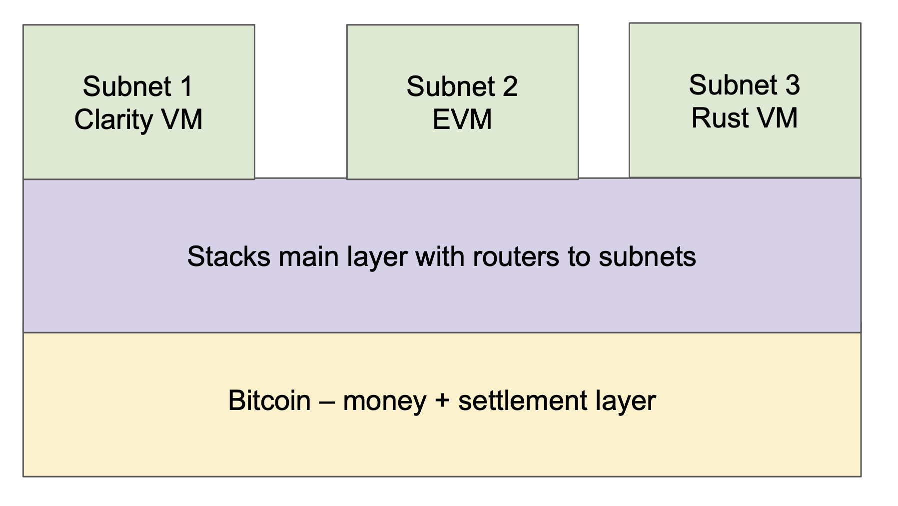

= Stacks: A Bitcoin Layer for Smart Contracts
:toc:
:sectnums:

[.normal]
Stacks is a Bitcoin layer for smart contracts; it enables smart contracts and decentralized applications to trustlessly use Bitcoin as an asset and settle transactions on the Bitcoin blockchain. The initial version of Stacks, launched in early 2021, introduced Bitcoin settlement of transactions, the Clarity language for safe contracts that can respond to Bitcoin transactions, and atomic swaps of assets with BTC. The next major proposed upgrade of Stacks, the Nakamoto release (expected 2023), adds important capabilities that will enhance the power of Stacks as a Bitcoin layer: (a) a decentralized, two-way Bitcoin peg to move BTC in/out of the layer and write to Bitcoin, (b) transactions secured by Bitcoin finality, and (c) fast transactions between Bitcoin blocks. The resulting Stacks layer makes Bitcoin a fully programmable asset in a trustless manner. This can make hundreds of billions of dollars of passive Bitcoin capital productive, unlock it for decentralized applications, and make Bitcoin the backbone of a more secure web3.

Bitcoin is the most decentralized, secure, and durable blockchain. BTC is a unique, widely held asset and the Bitcoin blockchain is the best final settlement layer for transactions. Applications that want to maximize decentralization and durability should use BTC as their asset and perform final settlement on the Bitcoin blockchain. However, to preserve its valuable properties, the Bitcoin blockchain is—by design—slow, minimal, and resistant to change. For example, it does not natively provide fully-expressive smart contracts or fast performance, so sophisticated applications cannot be built directly on it. Therefore, BTC remains a passive asset and most applications are instead built on Ethereum and other layer-1 (L1) blockchains that have less powerful native assets than BTC.

Bitcoin layers extend the functionality and improve the performance of Bitcoin without changing the Bitcoin L1. Examples include fast payments (Lightning) and general smart contracts (Stacks and RSK). In its conservatism toward changes, Bitcoin is comparable to FedWire as a settlement layer and to TCP/IP as the internet protocol: Higher-level layers are built on top of these, with additional functionality and innovation, but the base remains simple and stable. Bitcoin layers enable sophisticated applications that require fully-expressive smart contracts, high performance, or greater privacy.

The Stacks layer for smart contracts has the following innovations that make it unique:

[horizontal]
S:: **S**ecured by the entire hash power of Bitcoin (Bitcoin finality).
T:: **T**rust-minimized Bitcoin peg mechanism; write to Bitcoin.
A:: **A**tomic BTC swaps and assets owned by BTC addresses.
C:: **C**larity language for safe, decidable smart contracts.
K:: **K**nowledge of full Bitcoin state; read from Bitcoin.
S:: **S**calable, fast transactions that settle on Bitcoin.

The decentralized Bitcoin peg (see https://stx.is/sbtc-pdf[the sBTC paper] <<sbtc>>), fast transactions, and Bitcoin finality are proposed for the Nakamoto release, and other properties are already live on Stacks. More specifically, the Nakamoto release of Stacks:

. *Secured by Bitcoin:* enables Bitcoin finalization for Stacks transactions; after about 100 Bitcoin blocks or approximately a day of confirmations, the transactions that happened on the Stacks layer will be secured by the entire hash power of Bitcoin. Meaning that to reverse these transactions, an attacker will need to reorg Bitcoin. Such transactions settle on Bitcoin and have Bitcoin finality. Further, the Stacks layer forks with Bitcoin, so any state on Stacks automatically follows the Bitcoin forks.
. *Trust-minimized Bitcoin peg:* introduces a novel decentralized, non-custodial, Bitcoin-pegged asset, sBTC, so smart contracts can run much faster and more cheaply using the Bitcoin-pegged asset without compromising safety. This also enables contracts on the Stacks layer to trustlessly write to Bitcoin through the peg-out transactions.
Atomic swaps and assets: Stacks already has atomic BTC swaps and enables Bitcoin addresses to own and move assets defined on the Stacks layer. Magic swaps <<magic-swaps>> and Catamaran swaps <<defi-swaps>> are examples of trustless atomic swaps between BTC on Bitcoin L1 and assets on the Stacks layer that are already live. Further, users can own Stacks layer assets like STX, stablecoins, and NFTs on Bitcoin addresses and transfer them using Bitcoin L1 transactions if they prefer.
. *Clarity language:* supports Clarity, a safe, decidable language for provable smart contracts. With Clarity, developers can know with mathematical certainty what a contract can and cannot do, even before executing it <<clarity-lang>>. The decentralized peg contract will benefit from the safety properties of the Clarity language. As of Dec 2022, there are 5,000+ Clarity contracts already deployed on the Stacks layer <<stacks-onchain>>.
. *Knowledge of Bitcoin state:* has knowledge of the full Bitcoin state; it can trustlessly read Bitcoin transactions and state changes and execute smart contracts triggered by Bitcoin transactions. The Bitcoin read functionality helps to keep the decentralized peg state consistent with BTC locked on Bitcoin L1, amongst other things.
. *Scalable, fast transactions:* will provide high performance and scalability through several mechanisms, including faster Stacks layer blocks between Bitcoin blocks. Further, scalability layers like subnets~\ref{sec:subnets} can make different tradeoffs between performance and decentralization than the main Stacks layer. Subnets can support other programming languages and execution environments (e.g., Ethereum's Solidity and EVM, which allows all Ethereum smart contracts to use the Bitcoin-pegged asset and settle on the Bitcoin chain).

If users can easily move BTC in and out of a Bitcoin layer, and smart contracts at the layer are able to trustlessly read and write Bitcoin state then that unlocks the deployment of hundreds of billions of dollars of latent Bitcoin capital into applications like decentralized Bitcoin-backed lending, Bitcoin-backed stablecoins, and more. All these applications increase demand for Bitcoin, making it more valuable and increasing its utility to the world. Increased application activity through Stacks can result in higher transaction fees for Bitcoin miners, aiding Bitcoin's security in the long term, as Bitcoin coinbase incentives must be replaced by transaction fees in the coming years. The Nakamoto release of Stacks, with trustless writes and a decentralized Bitcoin peg, is a major step towards growing the Bitcoin economy.

The Stacks layer's consensus protocol, Proof of Transfer (PoX), inspired by Bitcoin's Proof of Work (PoW), is extremely energy-efficient and recycles PoW energy. The design of the decentralized peg is integrated with, and made possible by, PoX consensus. The Stacks layer's native token (STX) is essential to PoX consensus: STX is needed for (a) incentivizing Stacks miners to maintain the Stacks layer global ledger outside the Bitcoin L1, and (b) providing liveness guarantee to the sBTC peg and incentives for threshold signers that participate in the peg mechanism. Existing approaches to Bitcoin pegs, which lack a native token, cannot support a permissionless, open system and fallback to using custodians or trusting known federation members.

The Stacks Bitcoin layer project has followed the path of legal compliance with public disclosures and transparency, along with an explicit focus on decentralization. STX was distributed to the public through the first-ever SEC-qualified token offering in US history. The project explicitly decentralized before the Stacks mainnet launch in Jan 2021. Currently, more than 30 independent entities are working in the decentralized ecosystem.

== Bitcoin Layers

The decentralization of trust is the primary innovation and promise of blockchains. Even in the world of cryptocurrencies, recent failures in 2022 have been of centralized entities, further highlighting the importance of systems that don't rely on “trusted” centralized intermediaries. Bitcoin is the most secure, durable, and valuable blockchain; it is already used as a store of value by millions of people. It is robust, "hard" money, with unprecedented non-custodial ownership and lack of inflation. The Bitcoin blockchain is also the best settlement layer for transactions, as it is the most decentralized, censorship-resistant, and durable blockchain.

However, Bitcoin is relatively slow and minimal by design and conservative in its evolution to preserve these powerful properties. It produces blocks on average every 10 minutes, with only 5-7 transactions per second <<bitcoin>>. It does not provide native support for fully-expressive smart contracts and hence for sophisticated applications that can utilize its properties. The result is that Bitcoin has remained a passive rather than a productive asset. Despite its attractive and unique properties, it has not been a platform for applications besides a store of value and infrequent money movement.

Bitcoin layers change this. *Bitcoin layers extend the functionality and performance of the Bitcoin blockchain without requiring any changes to it.* Several Bitcoin layers exist today at different stages of development and maturity, such as Liquid for asset issuance, Lightning for fast payments, and Stacks and RSK for smart contracts. Lightning, for example, is a Bitcoin layer for scaling payments, enabling faster and cheaper payments in a trust-minimized manner. Lightning has a peer-to-peer design with no global interactions or state. Payments occur off-chain through peer-to-peer channels, which perform final net settlement on the Bitcoin main chain (via Bitcoin transactions) when the channels are closed. Peer-to-peer layers like Lightning do not provide global state or an execution environment for general computation, such as a virtual machine.

*Many applications, however, need smart contracts and a full execution environment.* They require global rather than just point-to-point interactions with global state, and they need the fuller expressive capability of smart contracts beyond what Bitcoin Script and Taproot provide on the Bitcoin main chain. Examples of applications that need fully-expressive smart contracts include Automated Market Makers (AMMs), liquidity pools, marketplace contracts for NFT trading, decentralized lending pools, and other known or yet-to-be-discovered applications in various disciplines. It is, therefore, essential to have Bitcoin layers that support fully-expressive smart contracts, and for those smart contracts to be able to use Bitcoin as their asset and the Bitcoin blockchain as the final settlement layer. This would generalize Bitcoin's capabilities while preserving full L1 security for the smart contract layer transactions.

=== Bitcoin Layers for Smart Contracts

Fully-expressive smart contracts enable developers to build any application logic that they desire. Such smart contracts require global accessibility and persistent storage for their state and code (whether compiled or not). The Bitcoin blockchain does not allow for arbitrary contract publishing and storing complex contract state, so contract logic and state must be stored and executed outside the Bitcoin L1. Because smart contracts should be immutable, they must be published on a global ledger that is immutable i.e., a separate blockchain.

Existing attempts to enable fully-expressive smart contracts in the broader Bitcoin ecosystem have focused on the sidechain approach. Sidechains are a type of Bitcoin layer that can support smart contracts, e.g., RSK and Liquid. In sidechains, BTC is “pegged-in” to a different blockchain (the sidechain) as a derived asset pegged 1:1 in value to BTC. Smart contracts run on that other blockchain and operate on the pegged asset there, without much interaction with the Bitcoin blockchain. BTC is “pegged out” to the Bitcoin blockchain when desired. The only connection with Bitcoin is through the peg-in and peg-out operations and possibly through leveraging Bitcoin mining power in merged-mining approaches. Smart contracts on the sidechain typically do not interact with Bitcoin transactions and BTC; there is no record of them on the Bitcoin blockchain. This differs from Bitcoin L2 layers, like Lightning, that can directly interact with Bitcoin transactions and settle transactions on Bitcoin L1. As of 2022, sidechains in the Bitcoin ecosystem (Liquid, RSK, etc) don't implement open-membership Bitcoin peg-outs. They rely on a federation of known, trusted entities or centralized custodians to do this. Nomic has implemented a decentralized Bitcoin bridge/peg in the Cosmos ecosystem which is at an early stage. Projects like tBTC <<tbtc>> and renBTC have attempted decentralized approaches to Bitcoin-pegged assets for Ethereum (recently renBTC is moving to a federated design).

RSK uses merged mining for block production and consensus, whereas Liquid uses a known federation of entities. The security of a merge-mined sidechain depends on how many Bitcoin miners also choose to mine the sidechain. If all do, the sidechain is very secure. However, if only some do—or during periods when only some do—it can be insecure as it becomes easy for a minority of Bitcoin miners to attack the sidechain (for example, the Namecoin chain was at risk of such attacks for long periods <<ma-thesis>>). Mining a smart contract chain is not the same as mining Bitcoin, as it requires running arbitrary contracts (programs) and dealing with much larger quantities of data and logic, not just solving hashes. Once there is substantial smart contract traffic, which current Bitcoin sidechains have not experienced, this can either become less attractive to miners or can reduce the decentralization of Bitcoin mining. So, *relying on Bitcoin miners for mining smart contract layers may not be a good long-term idea.*

=== Desirable Properties of a Bitcoin Layer for Smart Contracts

How should we implement a Bitcoin layer for general-purpose smart contracts that use BTC as their asset and settle on the Bitcoin blockchain? One way to look at this is by comparing what would happen if Bitcoin natively supported smart contracts (like Ethereum does <<ethereum>>). Such contracts would, of course, have their code and state on the Bitcoin chain, i.e., on a global ledger. They would also:

. have a ledger secured by the entire hash power of Bitcoin, 
. be triggered to execute by normal Bitcoin transactions, 
. be able to write (broadcast) signed transactions to the Bitcoin blockchain in a decentralized, trustless manner, i.e., without relying on any fixed set of entities, 
. have transactions settle on the Bitcoin chain, so a record of all smart contracts and transactions is verifiable in a trustless manner by anyone, like other Bitcoin transactions are, and 
. be subject to Bitcoin short-lived forks (i.e., if the Bitcoin chain experiences short-lived forks, then (a) only the contracts and transactions that end up on the canonical Bitcoin fork are valid, and (b) contracts and transactions should not become inconsistent with Bitcoin as a result of forks on Bitcoin).

While these are desirable characteristics, we also want mechanisms to achieve higher transaction throughput and lower latency of transaction completion than Bitcoin allows. Evaluating the sidechain approach against the properties of hypothetical native Bitcoin smart contracts, we see that it does not satisfy a number of the properties:

. The Bitcoin layer or its smart contracts are not secured by the full hash power of Bitcoin, unless every Bitcoin miner mines the sidechain too.
. Its smart contracts are not triggered by ordinary Bitcoin transactions (in current sidechain implementations).
. They can write Bitcoin transactions, though not in a trustless manner (given federated pegs).
. Other than peg operations, their transactions don't settle on the Bitcoin chain but are entirely separate, and transaction settlements cannot be verified on Bitcoin.
. They do not fork with Bitcoin as there is no close ongoing relationship between them, and they are largely unaware of Bitcoin forks.

The fact that a sidechain operates independently of Bitcoin, other than the peg, enables it to operate with higher transaction throughput and lower latency, largely unconstrained by the speed of Bitcoin, but without transactions settling on the Bitcoin blockchain. *The Stacks Bitcoin layer is designed to come as close to these desirable properties of native Bitcoin smart contracts as possible but also enables high performance.* In the next section, we present the Stacks Bitcoin layer for smart contracts and examine how it does with regard to these ideal properties of native Bitcoin smart contracts.

== The Stacks Bitcoin Layer

Stacks is a different type of Bitcoin layer for smart contracts than sidechains, with a deeper, ongoing connection to Bitcoin. The Stacks layer enables applications and smart contracts to use BTC as their asset or money and to settle their transactions on the Bitcoin main chain. *The goal of the Stacks layer is to grow the Bitcoin economy, by turning BTC into a productive rather than passive asset, and by enabling various decentralized applications.* Like sidechains such as RSK and Liquid, the Stacks layer has its own global ledger and execution environment, to support smart contracts and to not overwhelm the Bitcoin blockchain with additional transactions. However, the Stacks layer is unique as it has most of the ideal properties that native Bitcoin smart contracts would have. It also provides mechanisms for higher performance, such as fast blocks, the decentralized peg (xref:sec-sbtc[xrefstyle=short]), and subnets ( xref:sec-subnets[xrefstyle=short]). 

Unlike RSK and Liquid, Stacks also *has its own native asset (STX)*. This is not merely a governance or speculative token, but it is central to the consensus mechanism of the Stacks Bitcoin layer, discussed below, and is essential for two key goals: (i) it incentivizes mining of Stacks blocks with a “new block subsidy,” which is critical since transaction fees are not enough to sustain a ledger at least in the early days (as is the case with Bitcoin itself), and (ii) it serves as the liveness incentive and the basis for the economically secured decentralized Bitcoin peg. Despite having its own native asset, the Stacks layer helps grow Bitcoin and does not compete with Bitcoin (see xref:sec-competition[xrefstyle=short]).

The Stacks layer relies on STX and on BTC for its *novel consensus mechanism, called Proof of Transfer (PoX)*, that utilizes both the Stacks and Bitcoin layers. PoX is similar in spirit to Bitcoin's Proof of Work (PoW) consensus: Like how Bitcoin PoW miners spend electricity and are rewarded in BTC, Stacks PoX miners spend (already mined) BTC and are rewarded in STX. Like PoW, PoX uses a Nakamoto-style single-leader election: PoX miners bid by simply spending BTC, and they have a bid-weighted random probability of becoming a leader. Leader election happens on the Bitcoin chain and new blocks are written on the Stacks layer. In this way, *PoX reuses work already done by Bitcoin miners*, and does not consume any significant amount of additional electricity: only the cost of running normal laptops/computers for Stacks nodes to bid using BTC.

*Like PoW, PoX is permissionless:* Anyone can be a Stacks miner, as long as they are willing to spend BTC. Also, any STX holder can lock their STX (called “stacking”) to participate in PoX consensus, and earn Bitcoin rewards for doing useful work for the system, i.e., for being a signatory for the decentralized Bitcoin peg. In keeping with Bitcoin ethos, Stackers are rewarded for their positive contributions to the system and inhibited by economic disincentives from behaving poorly (but unlike in bonded Proof of Stake systems, they are not "slashed"). Finally, the nature of PoX consensus is such that the price ratio between BTC and STX is continually recorded and available on-chain, serving as an on-chain Bitcoin price oracle. This is valuable for the decentralized peg, removing the need for an external oracle, as described in the companion paper about the peg. More information about PoX consensus is available https://github.com/stacksgov/sips/blob/main/sips/sip-007/sip-007-stacking-consensus.md[here].

Stacks uses *Clarity, a much more secure language* than Ethereum's popular Solidity language, for the Stacks main layer and the decentralized Bitcoin peg. Clarity is a decidable language (not Turing-complete), meaning that you can know, with certainty, from the code itself what the program will do, and code correctness can be verified by software. Clarity is an interpreted rather than compiled language, so the source code of smart contracts is visible on the blockchain for verification by human beings, and it has post-conditions that provide additional execution safety. 

Using the Stacks layer, developers can build any application they can build on other smart contract platforms—like Ethereum, Solana, Avalanche, etc. -- but using BTC as their asset/money and settling their transactions on the Bitcoin blockchain. They will be able to do this in Clarity on the Clarity VM or -- using subnets (xref:sec-subnets[xrefstyle=short]) -- in Solidity or other languages on the EVM or other virtual machines. Users can also swap BTC natively for assets like stablecoins and NFTs directly from the Bitcoin chain.

In the rest of this section, we first examine how the Stacks layer rates with regard to the properties of hypothetical native Bitcoin smart contracts that we discussed earlier, and touch upon how it provides higher performance. We discuss how the fact that Stacks has a native token helps Bitcoin rather than hurting it. We then describe the decentralized two-way Bitcoin peg a little further (a detailed description is available in the sBTC paper <<sbtc>>), and we discuss the related security and forking rules of the Stacks chain in the new release. Finally, we discuss additional capabilities for performance and versatility, including subnets, future EVM compatibility, and the potential for ZK-rollups.

=== Stacks and "`Native Bitcoin`" Smart Contracts

The Stacks layer comes close to providing all the properties that native smart contracts on Bitcoin would, if they were available.

* *Bitcoin finality and security:* Stacks blocks that have about a day of confirmations achieve Bitcoin finality; i.e., they are secured by the Bitcoin blockchain and the entire hash power of Bitcoin (not only that of Stacks miners, and not like in merged mining). Beyond that point, the Stacks layer does not allow forks, so to reorganize the Stacks transactions would require successfully attacking Bitcoin with a deep reorg attack, which is extremely expensive and logistically difficult to pull off. It is worth noting that because Stacks blocks are recorded on Bitcoin blocks, information about them is publicly visible on the Bitcoin blockchain as they are produced, making it easy to detect attacks and reorgs and take countermeasures, and making hidden block attacks (such as selfish mining) much more difficult than on Bitcoin itself. 
* *Smart contracts being triggered by Bitcoin transactions:* Smart contracts on the Stacks layer can read Bitcoin state and can be triggered by standard Bitcoin transactions. This is because Stacks nodes also run Bitcoin nodes as part of consensus, and they read and index Bitcoin state eagerly.
* *Bitcoin writes:* The sBTC Bitcoin peg mechanism can *write Bitcoin transactions to the Bitcoin chain in a trustless manner*. Stacks also allows applications to deploy BTC directly from the Bitcoin chain; e.g., users can perform trustless atomic swaps between BTC and other assets (like stablecoins) on the Stacks layer. For faster performance, the Stacks layer also supports *decentralized, non-custodial peg-outs and peg-ins of a 1:1 pegged BTC*: BTC can be pegged in to the Stacks layer, smart contracts and other operations can operate upon it faster there, and it can be pegged back out onto the Bitcoin main chain. Unlike the derived assets of sidechains, like L-BTC in Liquid and RBTC in RSK, this peg is not reliant on a fixed federation or a federation of multisig hardware wallets for its peg-out. Rather, it achieves economic security through an open-membership set of signatories, in a manner integrated with the Stacks consensus protocol. Using sBTC with faster blocks and subnets allows smart contracts to operate with much lower latencies and higher throughputs than using BTC directly on the Bitcoin blockchain.
* Settlement and verification on Bitcoin. Hashes of all Stacks layer smart contracts and transactions *settle on the Bitcoin blockchain*. This is a necessary consequence of the operation of Stacks' PoX consensus protocol, and it happens dynamically, every Bitcoin block, as part of consensus.
* *Forking with Bitcoin.* The PoX protocol also gives the Stacks layer the desirable property of forking with Bitcoin. Bitcoin forks are naturally adapted to and "taken in stride" by the Stacks layer, such that the canonical Stacks chain is always found on the canonical Bitcoin chain, and smart contracts, transactions and the peg automatically stay in sync and uncorrupted even if Bitcoin forks. As a result of these properties, any suggested version of the Stacks ledger can be fully, independently verified by looking at the Bitcoin main chain, including and accounting for all forks, thus providing an additional layer of security and durability. That is, a user can independently verify which fork history of Stacks is correct simply by running an independent Bitcoin node.

The trustless Bitcoin peg enables much higher performance than could be achieved by native Bitcoin smart contracts. It does this by having smart contracts run on the faster Stacks layer, which provides faster-confirming, lower-latency blocks (still using Bitcoin as the asset and with final settlement on the Bitcoin chain), as well as through aggregation of thousands of Stacks transactions to a single hash for settlement.

[#sec-competition]
=== Synergies versus Competition with Bitcoin

The Stacks Bitcoin layer clearly relies on Bitcoin in a fundamental way. At the same time, the argument can be made that because it has its own token (STX), it pulls value away from Bitcoin.  While this may be true of other tokens that directly compete with Bitcoin, it is not true of STX as the Stacks layer helps grow the Bitcoin ecosystem rather than compete with Bitcoin. 

We mentioned earlier that the STX token is not merely a governance or speculative token, but it is necessary to the PoX consensus mechanism of the Stacks Bitcoin layer and essential for two key functional purposes: (i) incentivizing mining Stacks blocks with a new block subsidy, which is critical since transaction fees are not enough to sustain a ledger at least in the early days (as is the case with Bitcoin itself), and (ii) serving as the liveness incentive and the basis for the economically secured decentralized Bitcoin peg. 

The token is thus essential to the goal of building and growing decentralized applications that make Bitcoin productive and more useful. Such applications *increase demand for Bitcoin block space and make Bitcoin more valuable*. These applications and other activities that can be performed on Bitcoin using the Stacks layer also *result in higher transaction fees for Bitcoin miners*, in two ways: (a) the applications directly cause more transactions on the Bitcoin chain, which generate fees, and (b) Stacks mining and settlement on Bitcoin result in high-fee BTC transactions. These transaction fee incentives for Bitcoin miners become increasingly important as the Bitcoin coinbase rewards (or "new block subsidies") are reduced with "Bitcoin halvings" every four years and Bitcoin miners must rely more on transaction fees. Finally, enabling decentralized applications with Bitcoin gives users fewer reasons to use other chains and monetary assets that compete with Bitcoin.

The Stacks project was started by developers and computer scientists who have a long history of building in the Bitcoin ecosystem (some early developers of Stacks built the largest used early OP_RETURN based on-chain Bitcoin protocols <<virtualchain>>).

[#sec-sbtc]
=== The Decentralized, Permissionless Two-way Bitcoin Peg

Smart contracts that run on Bitcoin layers and truly use BTC as their asset must be able to not only read but also modify Bitcoin state. This means the signing of Bitcoin transactions with private keys by external software must be managed somehow. This “Bitcoin write” problem is difficult for transactions initiated by (external) smart contracts. Also, to perform all individual transactions and state updates on the Bitcoin chain in this way would be very slow and lead to a lot of long waits for transactions to complete. For performance, we should reduce the number of times transactions must be sent on Bitcoin and wait for completion.

Pegged Bitcoin assets aim to achieve these goals. A user locks an amount of BTC in a "peg wallet" on the Bitcoin chain and an equivalent amount of the pegged asset is issued on the other chain/layer (the "peg-in" operation). The pegged asset is used as often as desired on that layer (which maintains its own state), including by smart contracts, modifying state on that layer with higher performance. When desired, an amount of the pegged asset is destroyed and an equivalent amount of BTC released back on Bitcoin, i.e., unlocked from the peg wallet and sent to a specified Bitcoin address (the "peg-out"). The peg-out implements "Bitcoin writes" and the overall structure greatly improves performance. 

Because of signature management, the peg-out is a challenging operation. Pegged assets are implemented on other blockchains and Bitcoin layers, including wBTC on Ethereum, RBTC on RSK, and L-BTC on Liquid. However, in all those cases the pegs are entrusted to and managed by a centralized custodian or a federation of trusted and permissioned entities that sign the Bitcoin peg-out transactions (using multisig methods). wBTC, on Ethereum, has ranged from $5-$15B in usage, even though it is entrusted to a single custodian and hence antithetical to Bitcoin ethos. Reliance on centralized custodians or federations is unacceptable, especially for large amounts of BTC (e.g., hundreds of billions of dollars). 

sBTC<<sbtc>> is a decentralized pegged Bitcoin asset on the Stacks layer, pegged 1:1 to BTC, that does not rely on centralized or pre-determined entities for its management. Rather, it is maintained in a decentralized manner by a permissionless, open-membership group of dynamically changing entities that can start or stop contributing to peg maintenance as they please, but who—as a result of the design—have a clear economic incentive to properly maintain the peg. These entities are the Stackers of the PoX consensus protocol, who lock, or "Stack" STX and perform peg-out signing and other consensus-critical tasks; in return, they are rewarded in BTC proportionally to the STX they stack. The decentralized peg is integrated into the Stacks consensus protocol (Proof of Transfer or PoX), and it relies on PoX and its native STX token for the needed incentive engineering. Such a decentralized Bitcoin peg has been an unsolved, "holy grail" problem. It allows BTC to be made a productive asset in smart contracts without entrusting it to centralized entities, and to be deployed in applications like decentralized Bitcoin lending, Bitcoin-backed stablecoins, etc. with high performance and with the decentralized security that Bitcoin holders critically desire.

Anybody can become (or unbecome) a Stacker and hence a signer of peg-outs, just as anyone can become (or unbecome) a Stacks miner. The stacking of STX serves as collateral, and the BTC rewards as incentive, for the honest behavior of Stackers in signing proper peg-outs and not signing improper ones. The protocol provides incentive-compatible economic guarantees for a successful ledger and peg: For Stacks miners, it is always incentive-compatible to mine on the canonical fork, and for Stackers, it is always most profitable to faithfully maintain the peg. In keeping with Bitcoin's PoW ethos, Stackers are rewarded for their positive contributions to the system and inhibited by economic disincentives from behaving poorly (but they are not "slashed" for the latter, as in Proof of Stake systems). 

Peg-outs use a threshold signature mechanism: Liveness persists as long the Stackers of 70% of stacked STX sign the peg-outs, and safety is preserved (BTC cannot be stolen) as long as Stackers of at least 31% of the stacked STX do not sign unauthorized peg-outs (which are easily detected). Given the incentive compatibility, to compromise the peg wallet, a lot of Stackers would have to maliciously collude as well as behave economically irrationally. Peg-outs of arbitrary size are fulfilled within about 24 hours, and faster exchange of BTC/sBTC can be achieved through trustless atomic swaps. The STX token is essential to the economic guarantees that secure the sBTC Bitcoin peg in a permissionless setting. Existing sidechains (RSK, Liquid) that lack a native token cannot support a permissionless, decentralized peg and must rely on centralized, federated approaches. As Stacking incentives compensate the Stackers that maintain the peg, *sBTC does not need users to pay "wrapping fees"*, a key advantage over other pegged assets, including wBTC. 

The peg also inherits all the other properties and benefits of the Stacks Bitcoin layer.

=== Security and Forking Rules

The Stacks layer will receive a *major upgrade to its security model with the Nakamoto release*. The current version of Stacks has a separate security budget from Bitcoin. This security budget is defined by the BTC capital spent by Stacks miners. With the Nakamoto release, most of the Stacks chain history will have Bitcoin finality, regardless of the Stacks mining budget: *100% of Bitcoin mining power will secure the immutability of the Stacks layer, except for the last 150 blocks*. Specifically, after approximately 150 block confirmations, a Stacks layer block (and hence forks) will follow Bitcoin finality, and only the blocks less than 150 confirmations old will have a different security budget. Even for those recent blocks, the security budget will increase from being just the BTC spent by miners to including the capital locked by Stackers (which is in the hundreds of millions of dollars today). Stacks security therefore has a step function: 

* Forks are allowed within six Bitcoin settlement confirmations, the amount that exchanges and others wait to consider Bitcoin blocks finalized anyway. Such short-lived forking can be valuable, as they are in Bitcoin.
* To attack the recent history (within 150 blocks), e.g., to execute a double-spend attack on the Stacks layer, an attacker needs both a majority of Stacks mining power and at least 71% of Stackers to allow a fork carrying out the attack. Stackers typically do not allow forks unless they see on the Bitcoin chain that something very bad is happening (which they can see because of Stacks' early and ongoing visibility on the Bitcoin chain, and because alarms will therefore be raised). Getting more than 70% of Stackers to agree to such a fork is, therefore, very difficult and requires hundreds of millions in capital today: Stackers will only sanction it in this window if it is a fork designed to overcome something very bad happening on the Stacks layer. 
* By far the vast majority of block history on the Stacks layer (blocks with about 150 or more confirmations, i.e., about a day's worth) follow Bitcoin finality and are secured by 100% of Bitcoin's hash power. To attack the Stacks history, e.g., to alter any transaction more than about a day old, an attacker will need to do a deep reorg of Bitcoin which is extraordinarily difficult given the current security budget of Bitcoin and how decentralized Bitcoin mining is.

This new security model is a major upgrade for the Stacks layer and is highly differentiated from methods like merged mining or federated designs. The forking rules of Stacks are designed to minimize the possibility of forks in general while retaining the flexibility for miners to create forks under certain conditions to repair the chain as a response to specific attacks. More specifically, Stacks layer follows the following rules:

* Fast blocks are produced as a single sequence in-between two settlement blocks and they don't fork. A sequence of fast blocks of size M gets settled in the next settlement Stacks block. The miner that mines the settlement block can include a sequence of fast blocks of length 0 to M but there is only one sequence of fast blocks to consider for every settlement block. Miners of settlement blocks are economically incentivized to include the longest sequence of fast blocks i.e., the longest valid sequence that the miner has seen at the time of mining the settlement block. If a settlement block miner settles a smaller sequence then the miner is leaving money on the table.
* Forking rules only apply to settlement blocks, as a sequence of fast blocks is included within a settlement block. We can think of a settlement block as packaging all the transactions of the corresponding sequence of fast blocks.
* If (a) a Stacks settlement block reaches 150 Bitcoin block confirmations and (b) sBTC peg-out requests settled in that Stacks block successfully get processed by Stackers then that Stacks settlement block and all parent blocks will always be on the canonical Stacks fork. In other words, a Stacks block is “finalized” i.e., it can never be forked out of the canonical fork as soon as these two conditions are met. All parent blocks of a finalized block are also automatically finalized (even if any parent blocks did not have any sBTC peg-out requests in them). A finalized Stacks settlement block reaches Bitcoin finality, meaning that the only way to modify the chain history of finalized Stacks blocks is to do a deep reorg of Bitcoin. All fast blocks settled in a finalized settlement block also become final. No action at the Stacks layer can modify the chain of finalized Stacks blocks.
* Building Stacks forks from finalized Stacks blocks is not allowed with one exception: the latest finalized block i.e., the block that contains the last successfully-processed peg-out request can be used to build a new fork only if a majority of Stackers (70% or more) explicitly give permission to do so. This permission to create a fork from a Stacks block is called “Stacker blessing”.
* There can only be zero or one Stacker blessings present in the system at any given time. Stacker blessings can be overridden but there can be only one active Stacker blessing at max. The Stacker blessing disappears when the fork using the blessed block becomes the canonical fork, or it becomes impossible for miners to build on it due to the block becoming incompatible with the canonical fork.
* Miners can freely build new forks using Stacks blocks with depth 6 or less as parents. Miners cannot build forks using Stacks blocks with depth 7 to the latest finalized block as a parent, unless they have an explicit “blessing” from Stackers to initiate such a fork. Miners can never build forks from finalized blocks (minus the exception of the latest finalized block with a Stacker blessing).

The summary of forking rules is that:

. Stacks fast blocks: no forks
. Stacks settlement blocks depth 1 to 6: miners are free to create forks using these blocks.
. Stacks settlement blocks depth 7 to the latest finalized block are “frozen”: miners can only initiate forks through a Stacker blessing to “unfreeze” a block.
. No other forking is allowed i.e., all finalized blocks (except the latest finalized block) can never be used as a parent of a Stacks fork. 

Typically, users should not expect to see forks deeper than 6 settlement blocks. That should be a rare occurrence where the chain is actively under attack and Stackers allow the honest miners to recover the chain to a healthy state. Very few such attacks are even possible. Step (2) above is irrelevant for the security budget as most exchanges will require at least 6 settlement confirmations before considering a transaction as final. Bitcoin can fork within 6 blocks as well, so for important transactions you want to wait 7+ settlement confirmations. Step (3) above follows a security budget that is a combination of the majority of the mining power and a supermajority of the locked stacking capital. This is in the order of hundreds of millions of dollars today. Step (4) is 100% of Bitcoin security and is the strongest security guarantee. This is the security budget for most of the blocks in the Stacks layer chain history i.e., the bulk of the Stacks ledger is secured by Bitcoin mainchain hash power.

== Performance of Stacks

The initial version of the Stacks layer (2021) produces blocks at the speed of Bitcoin, which is unpredictable and slow (a block every 10 minutes, on average). In the Nakamoto release (2023), the Stacks layer will produce faster blocks in-between two Bitcoin blocks at the rate of approximately a new block every 5 seconds. The settlement of transactions to the Bitcoin main chain will still happen at the rate of Bitcoin blocks, but the Stacks blocks have a much lower, and predictable, latency.

Most modern smart contract L1s—like Ethereum, Solana, Avalanche etc. -- use Proof-of-Stake (PoS) based mechanisms to produce fast blocks without allowing forks. While there can be several disadvantages to PoS approaches, like inherently centralizing forces or inability to recover from certain failures without hard forks, these chains typically have low-latency block production and application users expect their transactions to get confirmations within seconds. On the other hand, block production in Bitcoin's Proof-of-Work (PoW) is both inherently unpredictable, given randomness of the hash function, and slower, as Bitcoin optimizes for decentralization by allowing ample time for block propagation to nodes with modest network connections. Further, Bitcoin allows forking and gives the network ample time to resolve short-lived forks.

The Stacks layer aims to give application users the best of both worlds: *fast transactions with Bitcoin finality*. Users get faster confirmations as Stacks blocks are produced in seconds, while all transactions on the Stacks layer eventually settle on Bitcoin in the background and benefit from 100% of Bitcoin's hash power for finalization.

The key idea is that Stacks can use the unique property of PoX consensus that PoX has access to both the Stacks and Bitcoin global ledgers. Using an open bidding process on the Bitcoin ledger, a group of Stacks miners is elected that can mine for the Stacks blocks until the next Bitcoin block (at a 10-minute average Bitcoin block time, this is approximately 120 Stacks blocks on average). Once the miner set is elected, these miners use BFT-style quorum signing, weighted by their BTC bids, to produce Stacks blocks every 5 seconds which *decouples the Stacks layer bandwidth from the time in-between Bitcoin blocks*. New miners can join the Stacks miner set at every Bitcoin block, preserving the open membership property of Stacks mining.

Thus, with the Nakamoto release, there will be two types of blocks at the Stacks layer:

* *Fast blocks* will be produced every 5 seconds through a BFT-style quorum signing mechanism by Stacks miners. Fast blocks can contain new transactions and contract calls, and fast block N+1 can build on the state of fast block N, forming a linear sequence of fast blocks. 
* *Settlement blocks* will be produced at every Bitcoin block. Settlement blocks do not contain any new transactions but only settle the recent sequence of fast blocks on the Bitcoin chain. Miners of settlement blocks are economically incentivized to include the longest sequence of fast blocks for settlement on Bitcoin.

Forks are not allowed in the fast blocks that appear between settlement blocks. Forks are only allowed at the level of settlement blocks, subject to the earlier forking rules.

[#sec-subnets]
=== Higher Performance and Versatility through Subnets

The Stacks Bitcoin layer provides additional capabilities for even higher performance, as well as for versatility and security. Despite its performance mechanisms described above, the Stacks layer optimizes for decentralization, like Bitcoin, instead of low latency or high network throughput: Users with normal laptops and home internet connections in remote locations should be able to run full Stacks and Bitcoin nodes. However, the main Stacks chain also serves as a coordinating layer for *higher performance Subnets.* A subnet also supports smart contracts, and it can make different tradeoffs between decentralization and performance than the main Stacks chain or other subnets. Additionally, individual subnets can support smart contracts in different programming languages and execution environments. As discussed further below, a subnet(s) may support Clarity and the Clarity VM, with its benefits of security, while another may support Ethereum's Solidity language and *EVM compatibility*, or compatibility with the Ethereum Virtual Machine, with its benefits of ease of integration and development and of leveraging all existing Solidity smart contracts to use BTC as their asset and settle on the Bitcoin blockchain.

.Scalability through subnets and different VMs

Subnets are a scalability and execution framework for the Stacks Bitcoin layer. On the performance side, applications may have different needs regarding low latency, high throughput, and burstiness of transaction volume (e.g., NFT minting). Subnets are designed for high throughput at the expense of reducing decentralization at the execution layer, while still settling transaction on the Bitcoin blockchain via the Stacks Bitcoin layer. L1 smart contract chains that promise fast speeds and high throughput (measured in transactions per second or TPS) effectively make mining more centralized by requiring high-powered miner nodes and datacenter-level bandwidth. 

The Stacks architecture, with the core layer and subnets, give application developers and users a choice between decentralized and lower throughput execution (Stacks main layer) or more centralized but higher throughput execution (a subnet). Miners/operators of a given subnet can require high network bandwidth between the miner set, like datacenter nodes, and can even whitelist the set of subnet miners to ensure high performance. 

Subnets are for execution, not for storage of assets. With high-performance subnets, developers and users can pick high throughput when they need it and can then withdraw their assets to the core Stacks layer when they wish. These assets can include STX or the Bitcoin-pegged sBTC. Note that the framework in concept parallels that of the pegged BTC asset between Bitcoin and the Stacks layer. 

Subnets can also support multiple execution environments, through multiple deployments of identical or different subnets. For example, a gaming application can be deployed as a separate subnet. This separates the gaming application network load from the rest of the application traffic. We believe scaling in modular layers and sub-networks is the best path to scalability. In this regard, our approach is like the concept of subnets in Avalanche and parachains in Polkadot. It differs from those systems in that applications on Stacks subnets benefit from Bitcoin's final settlement and security, and they have a tight integration with Bitcoin (like the Stacks core layer) wherein smart contracts deployed on subnets can be triggered by native Bitcoin transactions and they can use sBTC, through the Stacks layer, to trigger writes on the Bitcoin main chain.

=== Future Work: Bitcoin Rollups and the Stacks Layer

ZK rollups for Bitcoin present an interesting research area. With some changes to Bitcoin, potentially as soft forks, rollups for Bitcoin may be enabled in the future <<bitcoin-rolllups>>. The Stacks layer, with its full execution environment and more rapid pace of upgrades than Bitcoin, presents an excellent venue to experiment with Bitcoin rollups and other scalability technologies like fraud proofs. A rollup or fraud proof published at the Stacks layer can benefit from 100% of Bitcoin hash power as the relevant transactions/data reach Bitcoin finality. Moreover, the Stacks layer can serve as a natural storage layer for any data needed for rollups, with settlement on the Bitcoin blockchain.

Rollups and fraud proofs on the Stacks layer itself can be deployed today, including using the Bitcoin-pegged sBTC. In fact, there is some on-going work on a prototype implementation of Arbitrum-style fraud proofs for the Stacks layer. The Bitcoin-pegged asset sBTC can be used in these rollups and fraud proof systems, so that users can enjoy the benefits of rollups and fraud proofs (such as privacy and scalability) while using Bitcoin as their asset via sBTC. In the short-term, say the next two or three years, rollups on the Stacks layer are much more practical than rollups directly on the Bitcoin L1, since Bitcoin is historically cautious and slow to adopt any changes. However, even in the long-term it might be beneficial to use rollups using sBTC on the Stacks layer instead of, or in addition to, BTC on the Bitcoin chain. This is because of Maximal Extractable Value (MEV) and data storage. 

To exploit MEV incentives for rollups, it is far more economical to do reorderings/reorgs on the Stacks layer (at least for up to 6 blocks) in Stacks rollups than it is to do them at the Bitcoin level. With direct Bitcoin rollups, the MEV incentives will need to be handled directly at the Bitcoin level, which makes Bitcoin mining incentives much more complex than the current Bitcoin situation of fairly straightforward incentives. If the Stacks layer is used for rollups—for example, with sBTC—neither MEV incentives nor potential attacks are directly exposed to the Bitcoin blockchain (indirectly any Bitcoin layer that settles on Bitcoin will have some consequences for Bitcoin miner incentives). 

For storage for rollups data, it is better to use an external layer like Stacks than to grow the size of the main Bitcoin chain. Rollups and fraud proofs remain a relatively early yet exciting area for Bitcoin. The Stacks community and developers are researching and prototyping what rollups through Stacks can enable, especially through their use with sBTC and Bitcoin finality.

== Conclusion

With its Nakamoto release, the Stacks Bitcoin layer unlocks smart contracts and decentralized applications that use Bitcoin as their asset and perform the final settlement of transactions on the Bitcoin blockchain. Stacks allows BTC to be a productive asset without compromising its security and durability and enabling a wide range of applications like decentralized Bitcoin lending and Bitcoin-backed stablecoins. These applications through the Stacks layer allow people to use Bitcoin as money and the Bitcoin blockchain as the settlement of identity or application data, reducing the need for users to explore alternate, less secure L1 blockchains and crypto assets than BTC.

Key elements of the Stacks Bitcoin layer include (a) transactions secured by 100\% of the hash power of Bitcoin (Bitcoin finality), (b) a novel decentralized Bitcoin peg, sBTC, (c) atomic BTC swaps and assets owned by BTC addresses, (d) a secure programming language, Clarity, (e) reading and writing Bitcoin state, and (f) scalable, fast transactions that settle on Bitcoin. Further, the PoX consensus for Stacks forks with Bitcoin and has BTC rewards as incentives for positively contributing to the open protocol.

The decentralized peg has been a "holy grail" problem for Bitcoin for a decade, and existing pegs have relied on centralized mechanisms like custodians and trust in known federations without economic security. The sBTC peg for Stacks uses economic security with 1:1 BTC backing and incentive engineering, like Bitcoin itself, to enable a decentralized peg system with open membership for signers. The peg relies on several aspects of the Stacks layer—such as PoX consensus, Bitcoin finality, and BTC rewards—for its safety, incentive compatibility, and liveness. Without the unique properties of the Stacks layer, a decentralized, sBTC-like Bitcoin-pegged asset may not be commercially viable or incentive compatible.

The Stacks layer also provides fast blocks for low latency and subnets for high throughput. Subnets can enable smart contracts written in other languages and running in different execution environments, such as the Solidity language in the Ethereum Virtual Machine allowing familiar integration and development but using Bitcoin as money and settling on the Bitcoin blockchain. 

[bibliography]
== References

* [[[sbtc,1]]] sBTC: A decentralized two-way peg for bitcoin, Dec 2022. https://stx.is/sbtc-pdf.
* [[[magic-swaps,2]]] Magic protocol for atomic swaps with BTC and Stacks. https://magicstx.gitbook.io/magic-protocol/overview/magic-protocol.
* [[[defi-swaps,3]]] Muneeb Ali. Bitcoin DeFi is here: A deep dive into trust-less swaps, 2021. https://hiro.so/blog/bitcoin-defi-is-here-a-deep-dive-into-trust-less-swaps
* [[[ethereum,4]]] Vitalik Buterin. A next-generation smart contract and decentralized application platform. Technical report, 2014. https://ethereum.org/en/whitepaper/.
* [[[clarity-lang,5]]] Clarity: A decidable language for smart contract. https://clarity-lang.org/.
* [[[stacks-onchain,6]]] Stacks on chain: State of the network. https://stacksonchain.com/dashboards/State-of-the-Network/16.
* [[[bitcoin,7]]] Satoshi Nakamoto. Bitcoin: A peer-to-peer electronic cash system. Tech report, 2009.
https://bitcoin.org/bitcoin.pdf.
* [[[tbtc,8]]] tBTC: A Decentralized Redeemable BTC-backed ERC-20 Token. https://docs.keep.
network/tbtc/index.pdf.
* [[[ma-thesis,9]]] Muneeb Ali. Trust-to-Trust Design of a New Internet. PhD thesis, Princeton University 2017. https://www.cs.princeton.edu/research/techreps/TR-003-17.
* [[[virtualchain,10]]] Jude Nelson, Muneeb Ali, Ryan Shea, and Michael J Freedman. Extending existing
blockchains with virtualchain. In Workshop on Distributed Cryptocurrencies and Consensus Ledgers (DCCL'16), Chicago, IL, June 2016.
* [[[bitcoin-rollups,11]]] John Light. Validity rollups on bitcoin, 2021. https://bitcoinrollups.org/